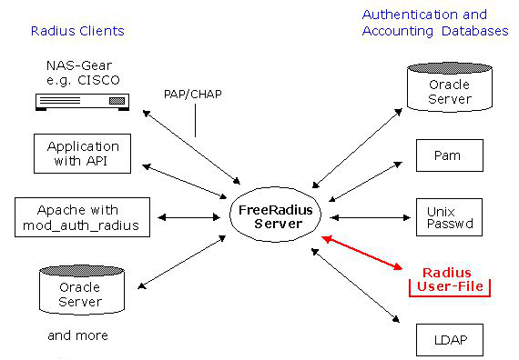

# radius介绍

## AAA框架

能够提供网络访问的设备通常称之为NAS（Network Access Server），这些设备可以是带有WPA2企业版安全实现的WiFi access point或者一个带有802.1x(EAP)的基于端口的认证的以太网交换机。所有这些设备需要进行一些形式的控制来确保合适的安全和使用. 这个要求通常被描述为AAA(Authentication, Authorization和Accounting)。

 

**AAA有时也被称为"三A框架"(Triple A Framework)，是一个高层是测架构模型，可以被各种方法实现；**

- **Authentication**：Authentication（认证）通常是第一步，这一步用来确定想要访问网络的用户提供的凭据是否是有效的，例如对用户提供的用户名和密码进行校验。验证成功后session将会初始化，session将持续到网络连接被终止。
- **Authorization**：Authorization（授权）是ISP（Internet Service Provider）控制资源的方式。当用户通过认证后，ISP可以对其进行某些权限的限制，例如规定用户打开的session数、分配特定的IP地址、带宽限制等。
- **Accounting**：Accounting（记账）是测量资源使用量的方法，当用户通过认证和授权后，ISP可以检测用户的使用量，以对其使用资源进行计费、趋势分析和行为监控。

## radius协议

RADIUS 协议全称为：Remote Authentication Dial-In User Service（远程身份验证拨入用户服务），提供在TCP/IP网络上的AAA。

 

RADIUS是基于UDP协议的一种C/S服务器协议，其客户端为网络访问服务器，通常为交换机、路由器或者无线访问点；服务端通常为运行在服务器上的守护进程。

### 请求响应的过程

如果 NAS 收到用户连接请求，它会将它们传递到指定的 RADIUS 服务器，后者对用户进行验证，并将用户的配置信息返回给 NAS。然后，NAS 接受或拒绝连接请求。

 

在客户端和服务器端之间可以建立成功的通信之前, 每一端必须定义一个shared secret. 这个是用来authenticate客户端。

 

**一个NAS作为一个RADIUS客户端.。**

### radius认证支持的形式

一个功能完整的RADIUS服务器应该支持多种认证机制，除了LDAP外还有：

- PAP（Password Authentication Protocol，密码验证协议，与 PPP 一起使用，在此机制下，密码以明文形式被发送到客户机进行比较）；
- CHAP（Challenge Handshake Authentication Protocol，挑战握手验证协议，比 PAP 更安全，它同时使用用户名和密码）；
- 本地 UNIX/Linux 系统密码数据库（/etc/passwd）；
- 其他本地数据库；
- Perl 、Python等程序；
- ...

在 RADIUS 中，验证和授权是组合在一起的。如果发现了用户名，并且密码正确，那么 RADIUS 服务器将返回一个 Access-Accept 响应，其中包括一些参数（属性-值对），以保证对该用户的访问。这些参数是在 RADIUS 中配置的，包括访问类型、协议类型、用户指定该用户的 IP 地址以及一个访问控制列表（ACL）或要在 NAS 上应用的静态路由，另外还有其他一些值。

 

### radius服务器端

radius服务器将会监听1812和1813端口：

- 1812端口：用于authentication，将会包含Access-Request, Access-Accept, Access-Reject, 和Access-Challenge包。
- 1813端口：用于accounting，将会包含Accounting-Request和Accounting-Response包。

 

**一个客户端和服务器需要一个共享的密钥(shared secret)为了加密和解密在RADIUS包中的某些域**

### radius客户端

radius客户端通常提供方为TCP/IP网络，客户端作为radius和想要使用网络权限的用户/设备的中间人。来自radius服务器的反馈可以决定用户能否访问网络，也可以对用户进行限制，例如限制时间和速度。

 

**RADIUS的proxying功能也允许一个RADIUS服务器成为另一台RADIUS服务器的客户端, 将会最终形成一个链条.**

 

### radius accounting

radius accounting运行在1813端口，当一个用户的session开始, NAS发送一个Accounting-Request包给RADIUS服务器，他是在成功authentication之后发送的第一个包，服务器端将会确定接收通过发送一个匹配的Accounting-Response包。

 

在整个session， NAS可以发送可选的update报告关于一个指定用户的时间和数据使用。当用户的session结束， NAS通知服务器。这个将关闭在用户的session期间的accounting细节。

# freeradius介绍

## freeradius

freeradius是radius协议的一种开源实现，世界上大部分的radius服务器都是基于freeradius开发而来的。freeradius一般用来进行账户认证管理，记账管理等。

 

Freeradius包含一个radius服务器和radius-client，可以对支持radius协议的网络设备进行鉴权记账，常见的开源路由器操作系统：如Openwrt,DD-wrt等，都支持radius协议，对PPPOE，热点，VPN等服务器进行账户管理认证，记账。

**大多数时候，Freeradius就是指radius服务器。**

## freeradius特点

- Freeradius是一个世界范围内广泛开发的开源免费Radius服务器，它为许多世界性公司、isp运营商和组织提供AAA(Authentication，Authorization，Accounting)认证服务；
- Freeradius是一个模块化，高性能并且功能丰富的一套Radius程序，包含服务器，客户端（radius client），开发库和一些额外的相关radius工具；
- 作为第一款开源发布的Radius程序，同时作为一个普通安装包，被许多种操作系统内置。还有二进制的包给其他系统使用，并且有源码几乎可以被任何系统编译安装；
- Freeradius操作稍显麻烦，内置diaup_admin简单web管理；

## freeradius相关命令

freeradius安装后会有许多命令，常见的命令功能如下：

- sbin/raddebug：用于调试输出
- sbin/radiusd、sbin/freeradius：服务程序
- sbin/radmin：连接到一个运行的radiusd daemon的管理程序
- bin/radclient：用来发送各种RADIUS包到RADIUS服务器和显示回复
- bin/radconf2xml：以XML格式显示当然服务器的配置
- bin/radcrypt：加密或者检查密码以DES或MD5格式
- bin/radeapclient：发送EAP包给一个RADIUS服务器
- bin/radlast：用于显示从accounting 日志文件的输出
- bin/radsqlrelay：用于管理记录在一个SQL日志文件的账户细节
- bin/radtest：发送Access-Request包给一个RADIUS服务器, 并且显示回复 radclient的前端
- bin/radwho：从radutmp文件显示活跃的连接
- bin/radzap：用于移除在session数据库(file或者SQL)里的欺骗记录(rogue entries)
- bin/smbencrypt：给定一个明文密码的nt密码哈希, 被MS-CHAP需要