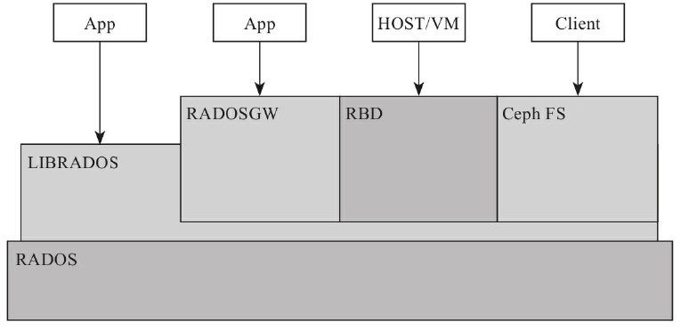
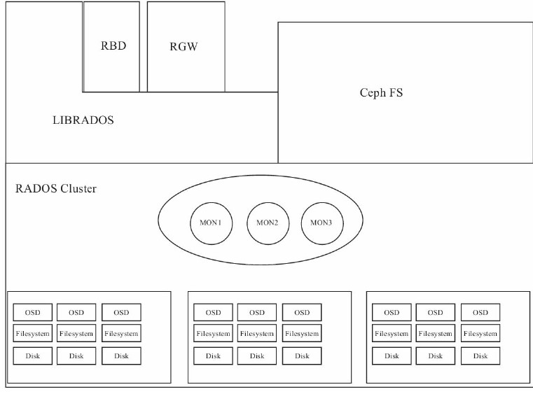
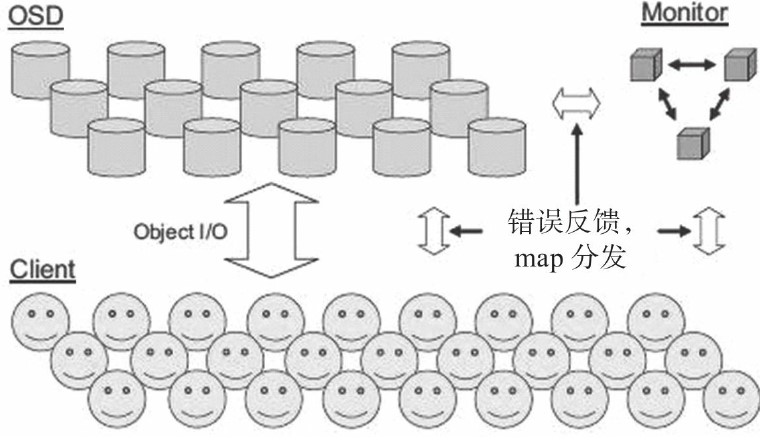
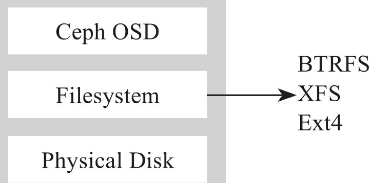
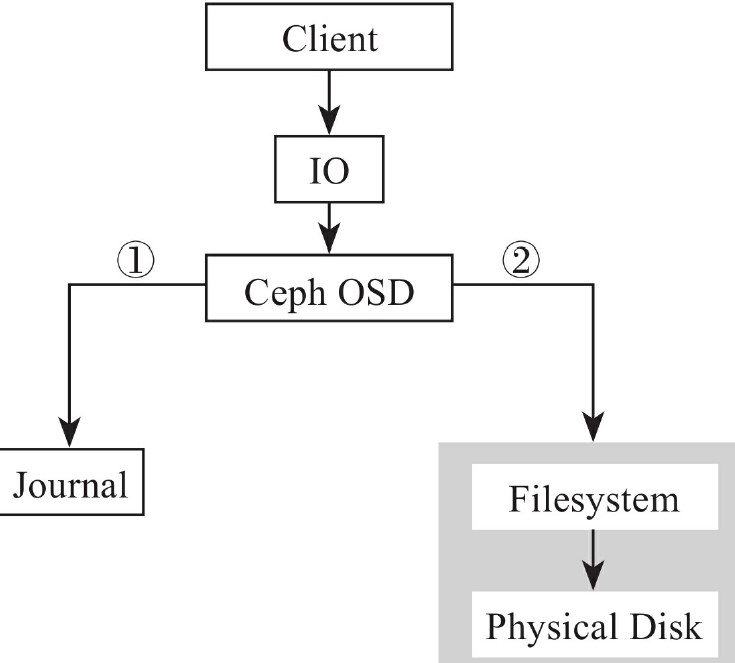

# ceph存储概述

Ceph 提供了对象、块、和文件存储功能，它可靠性高、管理简便、并且是自由软件。 Ceph 的强大足以改变IT 基础架构、和管理海量数据。


Ceph 可提供极大的伸缩性——供成千用户访问 PB 乃至 EB 级的数据。 Ceph 节点以普通硬件和智能守护进程作为支撑点， Ceph 存储集群组织起了大量节点，它们之间靠相互通讯来复制数据、并动态地重分布数据。


Ceph集群至少包含一个Ceph Monitor和两个OSD进程。当使用CephFS的时候必须要有元数据服务器MDS。


Ceph提供了RADOS、OSD、MON、Librados、RBD、RGW和CephFS等组件功能，但底层仍使用RADOS。


# 功能特性

Ceph能同时提供对象存储RADOSGW、块存储RBD、文件系统存储CephFS三种功能。

- RADOSGW功能特性基于LIBRADOS之上，提供当前流行的RESTful协议网关，支持s3和swift接口，可对接网盘类似应用及流媒体应用。

- RBD功能特性基于LIBRADOS之上，通过LIBRBD创建一个块设备，作为传统块设备使用。

- CephFS功能特性基于RADOS实现分布式文件系统，引入MDS提供元数据存储。一般当做文件系统挂载。


# CRUSH算法

CRUSH算法是Ceph的核心。Ceph将客户端数据保存为存储池中的对象。通过使用CRUSH算法计算出哪个PG（归置组）持有指定对象，然后计算出哪个OSD持有该PG。CRUSH算法使得Ceph集群可以动态伸缩、再均衡和修复。


CRUSH算法是一种基于伪随机控制数据分布、复制的算法。CRUSH只需要一个简洁而层次清楚的设备描述，就可以将数据对象映射到存储设备上。


# 系统架构

ceph中大体分为下面三个大的概念：

1、OSD：Ceph OSD的作用是存储数据，处理数据的复制、恢复、均衡等。OSD间会发送心跳信息并向Ceph Monitor提供监控信息。集群中至少要有2个OSD来实现active+clean健康状态和有效的保存数据的双副本。每一个分区、Disk都可以成为OSD。


2、Monitor：Ceph Monitor负责监控整个集群的健康状况。维护着集群OSD map、PG map、CRUSH map和MDS map。


3、MDS：Ceph MDS为CephFS存储元数据，只有CephFS需要。基于POSIX文件系统为用户提供基础命令如ls等。


ceph的架构图如下所示：



- RADOS是ceph的底层核心，提供可靠、自动、智能的分布式存储，具有自我修复特性；
- LIBRADOS是对RADOS的抽象和封装，并向上层提供API，便于基于RADOS进行开发。LIBRADOS实现的API是针对对象存储功能的。支持多种语言；
- RADOSGW基于RESTful的协议网关，兼容s3和Swift；
- RBD通过kernel客户端和QEMU/KVM驱动，提供一个完全分布式的块设备；
- CephFS通过kernel客户端结合FUSE，提供兼容POSIX的文件系统；


# 硬件/软件配置

Ceph可以使用普通的硬件设备支持PB级别的数据。规划需要考虑区域失效和潜在的性能问题。推荐在一台机器上运行一种类型的守护进程，并且将使用数据集群的进程（如OpenStack）和Ceph分离。


## CPU

MDS对CPU有要求，应该使用4核及以上的CPU。OSD至少需要双核的CPU。Monitor对CPU不敏感。


## 内存

MDS和Monitor至少每个进程需要提供1G内存以保证收到请求时响应速度。OSD在只有在数据恢复的时候需要占据比较多的内存，官方建议每进程每1TB占据1G内存。


## 磁盘

OSD应该有足够的空间存储对象，建议使用大于1TB的硬盘。

- 不能不顾分区而在单个硬盘上运行多个OSD；
- 不能不顾分区而在运行了OSD的硬盘上运行Monitor或者MDS；


>  Ceph允许在每个硬盘驱动器上运行多个OSD，但是导致资源竞争并降低总体吞吐量；


Ceph允许将日志和对象存储在同一个驱动器上但是会增加记录写日志并返回客户端的延迟。（btrfs在这里有优势）


考虑成本的话可以使用SSD存储OSD日志，把对象存储在独立硬盘，这样不但可以降低成本还可以提高性能。osd journal 选项的默认值是 `/var/lib/ceph/osd/$cluster-$id/journal` ，你可以把它挂载到一个 SSD 或 SSD 分区，这样它就不再是和对象数据一样存储在同一个硬盘上的文件了。


可以在一个主机上运行多个OSD，OSD数量较多时会派生大量线程（恢复数据和均衡期间更甚）。可以将内核默认最大线程数调大一点（默认32k），在 `/etc/sysctl.conf`  中写入 `kernel.pid_max = 4194303` 。


## 网络

每个机器最少两个千兆网卡，分别用于公网和集群网络。集群网络用于集群内部通信，处理数据复制产生的网络流量，可以防止DDOS攻击。


## 内核

内核版本至少在3.10以上，如果使用btrfs文件系统，则推荐使用3.14以上。


# ceph组件及定义


## 对象

对象是Ceph中基本的存储单元。对象由一个数据和一个元数据组成。元数据存储具体数据的关键属性描述信息。


每一个对象在Ceph内拥有一个唯一的对象标识符，以保证对象在集群内的唯一性。对象会随着其元数据的增大而变得非常巨大。


## CRUSH

CRUSH（Controlled Replication Under Scalable Hashing）被Ceph用来精确计算数据应该被写入哪里及从哪里读取。


CRUSH按需计算元数据而不是存储元数据，从而解决了传统文件存储系统的瓶颈。元数据的计算过程称之为CRUSH查找，是由客户端使用自己的资源来完成的，消除了中心查找带来的性能问题和单点故障。


查找时首先从Monitor获取集群map副本，然后从map副本中获取集群配置信息，通过对象、池ID等生成对象，接着通过对象和PG数散列后得到Ceph池中最终存放对象的PG，再由CRUSH算法确定该PG对应的OSD位置，客户端直接和OSD通信完成数据写入和读取。


## 故障区

CRUSH支持各种基础设施和用户自定义，CRUSH设备列表中与定义了一系列设备，包括：磁盘、节点、机柜、开关、房间、数据中心等。这些组件称为故障区。用户可以通过自己的配置将不同的OSD分配到不同的区域，Ceph在存数据时会根据故障区的结构保证将每份数据在所定义的物理组件间完全隔离。


## 恢复和再平衡

故障区的任何组件出现故障，Ceph会将该OSD标记为down和out状态，在等待300秒后（默认情况）进行数据恢复和再平衡，这个值可通过配置文件 `mon osd down out interval` 参数调整。


## PG

任何数据都以对象的形式保存在PG（归置组）中，每个PG数据都会复制到多个OSD上以保证高可用。PG总数的计算公式为：

```
PG数 = (OSD数 * 100) / 最大副本数。
```


## PG与OSD关系

CRUSH将确定由PG到OSD的数据映射。将PG ID 作为算法的输入，得到包含多个OSD的集合，将第一个OSD作为主OSD，其他OSD依次作为从OSD。OSD集合的个数由副本个数决定，生产环境一般为3。OSD集合中的所有OSD将共同存储和维护此PG下的Object。


## Ceph池

Ceph池是存储对象的逻辑分区，每个池中包含若干个PG，进而实现将一定的对象映射到集群内不同的OSD中。不能同时以复制方式和纠错码方式创建。默认创建新的pool的时候在pool内存储的数据只会有2个副本。


## PG与Pool关系

Ceph存储支持池的概念，是存储对象的逻辑分区。Ceph Client端从Monitor检索到Cluster Map，写入对象到Pool。Pool的副本数目，Crush规则和PG数目决定了Ceph将数据存储的位置。


Pool至少要设置如下的参数：对象的所有权/访问权、PG数目、该Pool使用的CRUSH规则、对象副本数目。


## Cluster Map

Cluster Map记录了所有可用的存储资源及互相之间的空间层次结构。在Ceph中，数据的索引都是通过不同的Map来实现的。Map使得Ceph集群存储设备在物理层上做了一层防护，通过合理设置map可以保证在某一服务器死机的状况下，有其他副本保留在正常节点上。


# RADOS

分步式对象存储系统RADOS是Ceph的技术核心，它支持海量的存储对象。在Ceph中用户数据最终都由这一层的存储实现。Ceph的高可靠性、高性能、高扩展性等特性也由这一层提供。


## ceph功能模块和RADOS的关系




Ceph的逻辑结构大致分为：

- 基础分布式对象存储系统RADOS；
- 基于RADOS实现的CephFS；

- 于RADOS的LIBRADOS应用层接口；

- 基于LIBRADOS实现的RBD、RADOSGW；


## RADOS架构

RADOS主要由两个部分组成：

- OSD：有数目可变的大规模OSD组成集群，负责将数据以对象的形式存储在磁盘上。一般client会先从Monitor获取cluster map，然后直接与OSD进行I/O操作而不需要Monitor干预；

- Monitor：少量Monitor主城小规模集群，负责管理RADOS中的关键数据、成员关系、数据分发等；通过选举产生leader。建议Monitor个数为奇数。





对于Ceph OSD来说，基于配置的副本数，Ceph提供通过分布在对各节点上的副本数来实现数据可靠、自动恢复和平衡。


在OSD中每个对象都有一个主副本和多个从副本。这些副本默认分布在不同节点上。每个OSD都可以作为某些对象的主OSD，也可以作为某些对象的从OSD。从OSD受到主OSD控制。在磁盘故障时，OSD进程将协同其他OSD进程进行数据恢复，这时候从OSD将升级为主OSD，与此同时生成新的副本。





如果OSD使用的文件系统为btrfs或者xfs，那么在提交数据到存储器前，Ceph先将数据写入到单独的journal存储区。默认情况下journal常用大小为10G。使用SSD作为journal盘将提高很多的性能。





