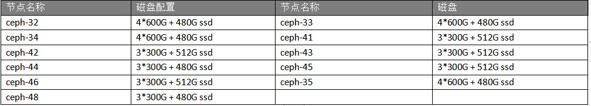
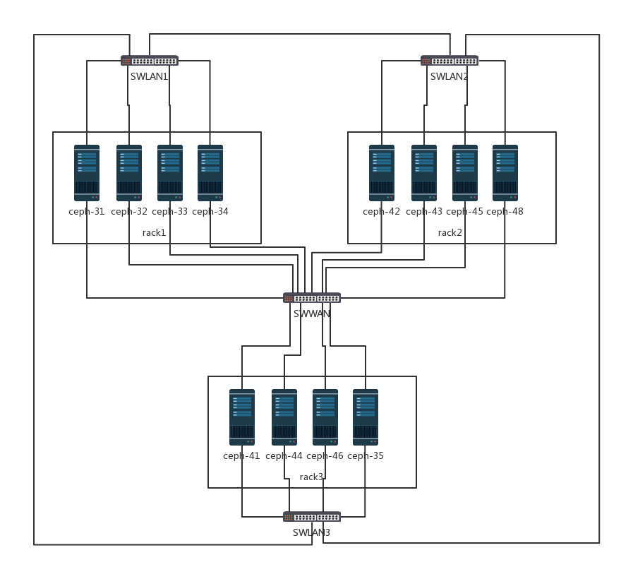
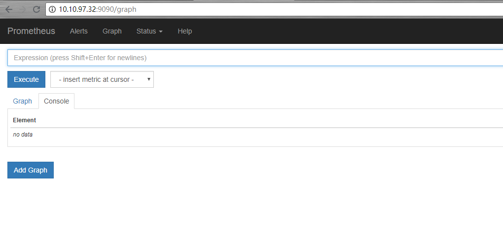
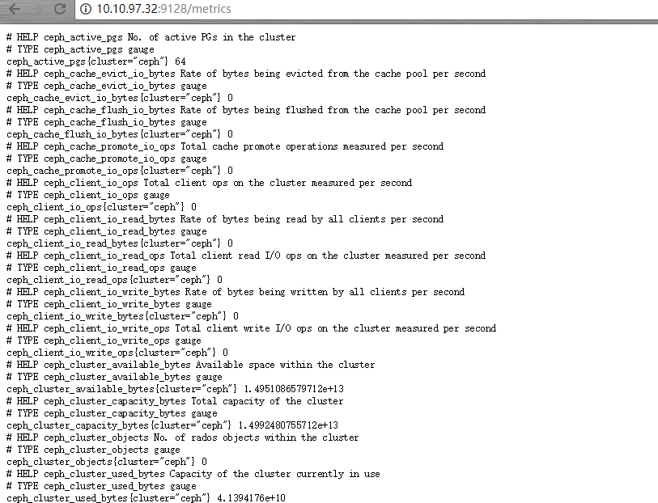
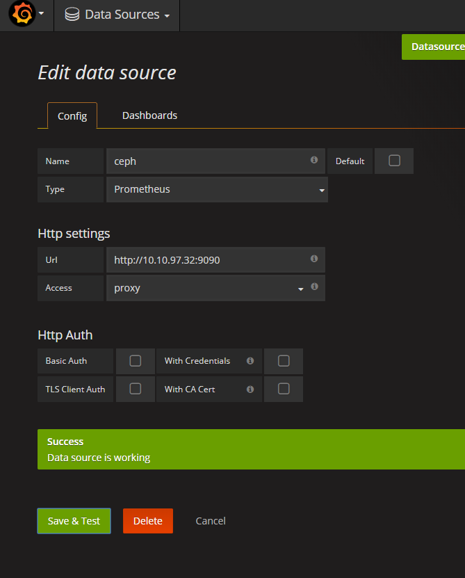
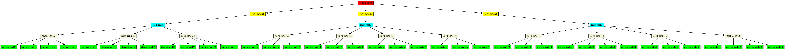

# 集群规划

## 部署方式

采用ceph-deploy方式部署，ceph-deploy作为管理端单独在一个服务器上。


## 服务器规划

总计11台服务器，每个服务器有一个ssd盘作为journal挂载点，其余机械硬盘作为osd节点。mon节点由三台服务器组成，复用osd节点。


## 服务器配置

所有服务器双网卡，一个网卡作为集群内通信，另一个作为集群外通信，磁盘配置如下：




## 服务器上架规划

下图为服务器拓扑，也作为crushmap结构



> 根据高可用原则，这里的三个mon节点不应该在一个机柜下，这是一个纰漏。


#  部署前准备

未特殊声明，在所有的节点，包括mon、osd和deploy节点进行操作。

 

注意，需要打开创建用户相关的文件的锁，否则生成的ceph相关文件权限不是ceph用户。

```bash
$ chattr -i /etc/passwd /etc/shadow /etc/group /etc/gshadow
```


## 时间同步

```bash
$ ntpdate 123.162.191.94  & hwclock -w
$ systemctl restart crond
$ systemctl restart rsyslog
$ echo “ntpdate 123.162.191.94  &” >> /var/spool/cron/root
```


## 关闭selinux

```bash
$ setenforce 0
$ vim /etc/selinux/config
SELINUX=disabled
```


## 安装iptables并开放防火墙

```bash
$ yum install -y iptables iptables-services
# 将这两条加入/etc/sysconfig/iptables，这个是我的两个内网
-A INPUT -s 10.10.97.0/24 -j ACCEPT
-A INPUT -s 192.168.8.0/24 -j ACCEPT

$ systemctl restart iptables
```


## 添加hosts解析

```bash
$ cat >> /etc/hosts << EOF
10.10.97.31 ceph-31
10.10.97.32 ceph-32
10.10.97.33 ceph-33
10.10.97.34 ceph-34
10.10.97.35 ceph-35
10.10.97.41 ceph-41
10.10.97.42 ceph-42
10.10.97.43 ceph-43
10.10.97.44 ceph-44
10.10.97.45 ceph-45
10.10.97.46 ceph-46
10.10.97.48 ceph-48
EOF
```


## 设置ssh免密秘钥登录

需要从ceph-deploy端也就是ceph-31上设置免秘钥登录到其他节点：

```bash
$ ssh-keygen
$ ssh-copy-id ceph-32
$ ssh-copy-id ceph-33
$ ssh-copy-id ceph-34
$ ssh-copy-id ceph-35
$ ssh-copy-id ceph-41
$ ssh-copy-id ceph-42
$ ssh-copy-id ceph-43
$ ssh-copy-id ceph-44
$ ssh-copy-id ceph-45
$ ssh-copy-id ceph-46
$ ssh-copy-id ceph-48
```


## 安装epel源和ceph源

```bash
$ yum install -y epel-release
$ cat > /etc/yum.repos.d/ceph.repo <<EOF
[ceph-noarch]
name=Ceph noarch packages
baseurl=https://download.ceph.com/rpm-kraken/el7/noarch
enabled=1
gpgcheck=0
type=rpm-md
gpgkey=https://download.ceph.com/keys/release.asc

[ceph]
name=Ceph packages for 
baseurl=http://download.ceph.com/rpm-kraken/el7/x86_64
enabled=1
gpgcheck=1
type=rpm-md
gpgkey=https://download.ceph.com/keys/release.asc

[ceph-source]
name=Ceph source packages
baseurl=http://download.ceph.com/rpm-kraken/el7/SRPMS
enabled=0
gpgcheck=1
type=rpm-md
gpgkey=https://download.ceph.com/keys/release.asc
EOF
$ yum clean all 
$ yum makecache
```


# 部署ceph-deploy节点

## 安装ceph-deploy

在ceph-31上执行下面的命令安装ceph-deploy：

```bash
$ yum install -y ceph-deploy
```


## 创建目录存放证书

```bash
$ mkdir /etc/ceph
```


# 部署集群

## 部署mon节点

```bash
$ cd /etc/ceph

# 将生成ceph.conf  ceph-deploy-ceph.log  ceph.mon.keyring
$ ceph-deploy new ceph-32 ceph-33 ceph-34
```


## 修改ceph.conf

在ceph.conf中添加如下配置（除了注释）：

```bash
osd_pool_default_size = 3		// 默认副本数

public network = 10.10.97.0/24		// 公共网络

cluster network = 192.168.8.0/24	// 集群网络（心跳信息、数据恢复流量）


[mon]
mon_allow_pool_delete = true		// 允许ceph 集群删除pool
```


## 安装ceph

需要在ceph集群的mon和osd节点都安装ceph软件包，安装前需要添加ceph用户和组。

```bash
$ ceph-deploy install ceph-32 ceph-33 ceph-34 ceph-35 ceph-41 ceph-42 ceph-43 ceph-44 ceph-45 ceph-46 ceph-48
```


上面命令本质是使用ssh远程安装，如果遇到失败情况也可以在失败的节点手动执行下面的命令安装

```bash
$ yum install -y ceph ceph-radosgw
```


## 初始化mon

```bash
# 生成了ceph.bootstrap-mds.keyring  ceph.bootstrap-mgr.keyring  ceph.bootstrap-osd.keyring  ceph.bootstrap-rgw.keyring  ceph.client.admin.keyring并在mon节点启动进程
$ ceph-deploy mon create-initial	
```


## 发送秘钥到mon节点

```bash
$ ceph-deploy admin ceph-32 ceph-33 ceph-34
```


并且在mon节点需要给ceph.client.admin.keyring增加读权限：

```bash
$ chmod +r /etc/ceph/ceph.client.admin.keyring
```


## 擦净磁盘

在创建osd之前先将磁盘擦净，防止先前的数据有影响。磁盘擦除的命令格式如下：

```bash
$ ceph-deploy disk zap <ceph-node>:<disk>
```


例如：

```bash
$ ceph-deploy disk zap ceph-32:sdb
```


## 对ssd硬盘分区

使用fdisk命令对ssd硬盘分区，用于挂载journal文件，每个osd盘对应一个日志分区。分区过程略。创建完成后需要更改journal分区的用户和组为ceph，如：

```bash
$ chown ceph:ceph /dev/sdf1
```


> 为了防止这一步在重启后失效，可以写到rc.local中在重启机器后自动执行。


## 初始化osd节点

使用如下的命令初始化osd节点：

```bash
$ ceph-deploy osd prepare --fs-type <fstype> <ceph-node>:<disk>:<journal>
```


如：

```bash
$ ceph-deploy osd prepare --fs-type btrfs ceph-32:/dev/sdb:/dev/sdf1 
```


> 这里采用的是btrfs，ceph默认使用xfs


## 激活osd节点

使用如下命令激活osd节点

```bash
$ ceph-deploy osd activate <ceph-node>:<osd_partation>
```


如：

```bash
$ ceph-deploy osd activate ceph-32:/dev/sdb1
```


## 检查

在mon节点上执行下面的命令查看集群状态：

```bash
$ ceph -s 
cluster 1f0b7f8f-d206-4002-af3f-54033e68a781
     health HEALTH_WARN
            too few PGs per OSD (5 < min 30)
     monmap e2: 3 mons at {ceph-32=10.10.97.32:6789/0,ceph-33=10.10.97.33:6789/0,ceph-34=10.10.97.34:6789/0}
            election epoch 8, quorum 0,1,2 ceph-32,ceph-33,ceph-34
        mgr active: ceph-33 standbys: ceph-32, ceph-34
     osdmap e176: 38 osds: 38 up, 38 in
            flags sortbitwise,require_jewel_osds,require_kraken_osds
      pgmap v532: 64 pgs, 1 pools, 0 bytes data, 0 objects
            39476 MB used, 13924 GB / 13962 GB avail
                  64 active+clean
```


> `health HEALTH_WARN`  表明当前集群的状态并不是健康的，因为每个OSD中的PG小于最小值30


## 调整pg个数

由命令 ceph -s 可以看出，当前每个osd上pg个数为5个小于最小值30。这个值是如何计算的呢？


首先查看当前池（默认rbd）的pg和pgp个数：

```bash
$ ceph osd pool get rbd pg_num
pg_num: 64
$ ceph osd pool get rbd pgp_num
pgp_num: 64
```


查看副本个数

```bash
$ ceph osd dump | grep size
pool 0 'rbd' replicated size 3 min_size 2 crush_ruleset 0 object_hash rjenkins pg_num 64 pgp_num 64 last_change 1 flags hashpspool stripe_width 0
```


可以看见，当前rbd池中pg和pgp个数为64，副本个数3，osd总数38个，所以每个osd上的pg个数约为：

```bash
64 / 38 * 3 ≈ 5
```


在调整前需要计算pg和pgp个数，计算公式如下：

```bash
pg总数 = （osd总数）* 100 / 最大副本数
```


所以在目前的情况下：

```bash
pg总数 = 38 * 100 / 3 ≈ 1266
```

> 取以上结果最接近的2的N次幂，及1024


修改pg和pgp个数为这个值：

```bash
$ ceph osd pool set rbd pg_num 1024
$ ceph osd pool set rbd pgp_num 1024
```

>  如果出现调整跨度过大的问题，先调整到256，再调整到512，再向上调整。


再次检查集群状态：

```bash
$ ceph -s 
    cluster 1f0b7f8f-d206-4002-af3f-54033e68a781
     health HEALTH_OK
     monmap e2: 3 mons at {ceph-32=10.10.97.32:6789/0,ceph-33=10.10.97.33:6789/0,ceph-34=10.10.97.34:6789/0}
            election epoch 8, quorum 0,1,2 ceph-32,ceph-33,ceph-34
        mgr active: ceph-33 standbys: ceph-32, ceph-34
     osdmap e180: 38 osds: 38 up, 38 in
            flags sortbitwise,require_jewel_osds,require_kraken_osds
      pgmap v555: 1024 pgs, 1 pools, 0 bytes data, 0 objects
            39513 MB used, 13924 GB / 13962 GB avail
                1024 active+clean
```

> 现在已经变成ok状态了


# 集群监控


## 集群监控方案

集群监控系统采用prometheus + grafana + ceph_exporter的方式，这也是主流的监控平台。监控平台的组件部署在一个mon节点上即可。

> 这里暂时没有考虑监控平台的高可用


## 安装及运行prometheus

下载prometheus

```bash
$ wget https://github.com/prometheus/prometheus/releases/download/v2.0.0/prometheus-2.0.0.linux-amd64.tar.gz 
$ tar zxf prometheus-2.0.0.linux-amd64.tar.gz
$ cd prometheus-2.0.0.linux-amd64
```


修改 `prometheus.yml` 文件增加job：

```bash
  - job_name: 'ceph'
    honor_labels: true
    file_sd_configs:
      - files:
        - ceph_targets.yml
```


修改  `prometheus.yml` 文件中监听的地址

```bash
static_configs:
  - targets: ['10.10.97.32:9090']
```


同路径下创建ceph_targets.yml

```bash
$ cat > ceph_targets.yml << EOF
[
    {
        "targets": [ "10.10.97.32:9128" ],
        "labels": {
            "instance": "ceph_cluster"
        }
    }
]
EOF
```


启动prometheus

```bash
$ nohup ./prometheus &
```


## 检查prometheus

浏览器访问本机的9090端口，这里是 10.10.97.32:9090看到如下的界面这说明prometheus正常




## 安装及启动ceph_exporter

安装依赖

``````bash
$ yum install -y golang librados2-devel librbd1-devel
``````


设置环境变量

```bash
cat > /etc/profile.d/go.sh << EOF
export GOROOT=/usr/lib/golang
export GOBIN=$GOROOT/bin
export GOPATH=/home/golang
export PATH=$PATH:$GOROOT/bin:$GOPATH/bin
EOF
source /etc/profile.d/go.sh
```


安装ceph_exporter

```bash
$ go get -u github.com/digitalocean/ceph_exporter
```

 

启动ceph_exporter

```bash
$ cd /usr/lib/golang/bin/

$ nohup ./ceph_exporter &
```


## 检查ceph_exporter

浏览器访问mon的9128端口的metrics接口，这里是 http://10.10.97.32:9128/metrics，显示如下界面说明正常




## 安装grafana

grafana安装这里不赘述，我使用的是已有的grafana。


## 在grafana中加入ceph数据源和模板




granfana的模板在 `files` 目录下自行导入即可。


# 自定义crushmap

设置crushmap最好是在集群创建前进行规划，一旦设置不要轻易改动，否则会引发大量数据迁移。


## crushmap结构

这里自定义crushmap结构按照机房上架的结构进行，分为三个机柜，每个机柜有一个交换机，结构图如下：


## 查看默认的crushmap结构

使用如下命令查看默认的crushmap结构

```bash
$ ceph osd tree
```


> 默认情况下所有的osd都按照主机的方式归属在root下。


## 创建crushmap

先添加机柜，这里我有3个机柜rack1 rack2 rack3，分别添加这些机柜到crushmap

```bash
$ ceph osd crush add-bucket rack1 rack
$ ceph osd crush add-bucket rack1 rack
$ ceph osd crush add-bucket rack1 rack
```


把机柜移动到根

```bash
$ ceph osd crush move rack1 root=default
$ ceph osd crush move rack2 root=default
$ ceph osd crush move rack3 root=default
```


按照服务器上架的结构将主机移动到对应的机柜

```bash
$ ceph osd crush move ceph-32 rack=rack1
$ ceph osd crush move ceph-33 rack=rack1
$ ceph osd crush move ceph-34 rack=rack1
$ ceph osd crush move ceph-42 rack=rack2
$ ceph osd crush move ceph-43 rack=rack2
$ ceph osd crush move ceph-45 rack=rack2
$ ceph osd crush move ceph-48 rack=rack2
$ ceph osd crush move ceph-41 rack=rack3
$ ceph osd crush move ceph-44 rack=rack3
$ ceph osd crush move ceph-46 rack=rack3
$ ceph osd crush move ceph-35 rack=rack3
```


这里我有3个交换机swlan1 swlan2 swlan3，分别添加这些到crushmap

```bash
$ ceph osd crush add-bucket swlan1 row
$ ceph osd crush add-bucket swlan2 row
$ ceph osd crush add-bucket swlan3 row
```


把机柜移动到交换机下

```bash
$ ceph osd crush move rack1 row=swlan1
$ ceph osd crush move rack2 row=swlan2
$ ceph osd crush move rack3 row=swlan3
```


把交换机移动到根下

```bash
$ ceph osd crush move swlan1 root=default
$ ceph osd crush move swlan2 root=default
$ ceph osd crush move swlan3 root=default
```


## 检查现在的crushmap

```bash
$ ceph osd tree
```

现在服务器按照机柜、交换机的方式进行排列，和机房上架的结构一致。


## 生成crushmap图片

使用命令查看crushmap的方式不直观，可以有python程序生成crushmap的图片。


源码请见 `files` 目录下的 `show_crushmap.py`  文件。


安装相关依赖

```bash
$ pip install -I pyparsing==2.1.4
$ pip install pydot 
$ pip install graphviz
$ yum install -y graphviz
```


首先导出json格式的crushmap

```bash
$ ceph report --format=json > crush.json
```


然后运行python程序生成图片

```bash
$ python show_crushmap.py crush.json
```

出现  `Sucessful, File = crushmap.png`  表示生成成功。




## 编辑文件方式修改crushmap

获得默认加密的 crushmap

```bash
$ ceph osd getcrushmap -o crushmap.dump
```


转换加密 crushmap 到明文格式

```bash
$ crushtool -d crushmap.dump -o crushmap.txt
```


> 此时便可以修改crushmap.txt文件了

 

编辑完文件后转换明文 crushmap 到加密格式

```bash
$ crushtool -c crushmap.txt -o crushmap.done
```


重新使用新 crushmap

```bash
$ ceph osd setcrushmap -i crushmap.done
```


# 清理ceph集群


## ceph-deploy清除ceph数据

官方文档有两种清除方式：

- purgedata ：清除数据但不删除软件包

- purge：清除数据并卸载软件包

 

但是官方在详细解释中说：purgedata 执行时会先判断主机是否安装ceph，若安装ceph将不会清除数据。

 

所以想要使用ceph-deploy清除数据就是用purge命令卸载软件包并清除数据好了，命令如下：

```bash
$ ceph-deploy purge <ceph-host>
```


注意，如果有osd盘还在挂载需要先卸载否则数据清理将失败。


## 手动不卸载ceph清理数据

首先杀死所有ceph进程：

```bash
$ ps aux|grep ceph |awk '{print $2}'|xargs kill -9
$ ps -ef | grep ceph
```


删除数据

```
$ umount /var/lib/ceph/osd/*
$ rm -rf /var/lib/ceph/osd/*
$ rm -rf /var/lib/ceph/mon/*
$ rm -rf /var/lib/ceph/mds/*
$ rm -rf /var/lib/ceph/bootstrap-mds/*
$ rm -rf /var/lib/ceph/bootstrap-osd/*
$ rm -rf /var/lib/ceph/bootstrap-rgw/*
$ rm -rf /var/lib/ceph/bootstrap-mgr/*
$ rm -rf /var/lib/ceph/tmp/*
$ rm -rf /etc/ceph/*
$ rm -rf /var/run/ceph/*
```


## 删除deploy节点的ceph文件

```bash
$ rm -f /etc/ceph/*
```

