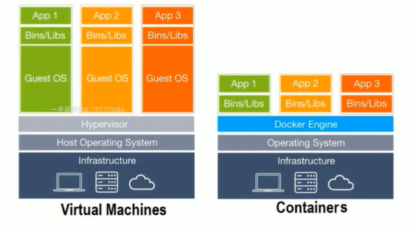
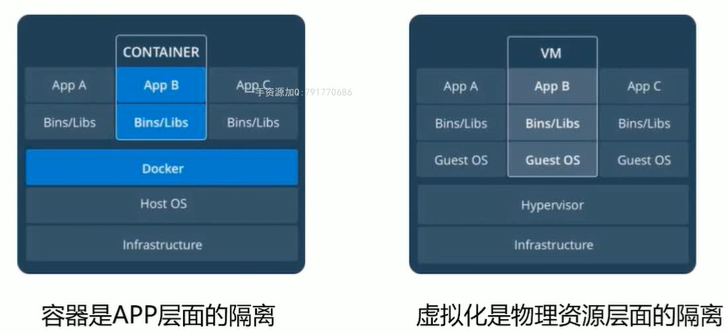
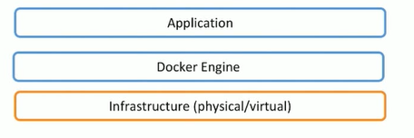
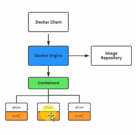
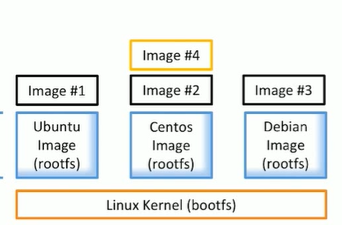

# 什么是容器技术

容器是对软件和其依赖的标准化打包，能够实现应用间的相互隔离。容器共享一个系统内核，可以在多个主流操作系统上运行。

 

容器技术解决了开发和运维的矛盾，为app提供了灵活的移植和扩展能力。

# 虚拟化和容器的区别

下图展示了虚拟化技术和容器技术的具体层级

## 从虚拟化角度

虚拟化技术通过Hypervisor对系统资源包括硬件设备进行虚拟化并对物理资源进行限定和调度。可以看见，每一个虚拟机都需要完整的操作系统，在操作系统上才是各种app。这就导致虚拟化出来的虚拟机体量比较大，启动速度慢且消耗资源多。

 

容器技术没有虚拟化这一层，其中不包含操作系统，只有app相关的依赖库，这样容器就很小巧，移植性强于虚拟化，启动速度快且消耗资源少。

## 从隔离角度

容器提供了app层面的隔离，而虚拟化提供了物理层面的隔离。

## 特性比较

从启动时间：

- 容器是秒级别启动，虚拟化启动时分钟级的；

 

从体量：

- 容器镜像通常以M为单位，虚拟机一般为G单位；
- 容器占用资源更少，部署比虚拟机快的多；

 

从性能：

- 容器共享宿主机内核，系统级虚拟化，占用资源少，没有虚拟化层级的开销，性能接近物理机；
- 虚拟机有虚拟化层级的开销，具有完整且独立的操作系统，开销大；

 

从安全性：

- 容器是进程级别的隔离，安全性不如虚拟机，容器具有访问内核的一定权限，具有一定风险；

 

从使用要求：

- 虚拟化技术要求硬件例如cpu支持虚拟化，而容器可以运行在大多数主流的操作系统上，不用考虑底层是否支持虚拟化；

# 容器技术的作用

容器技术可以有如下的作用：

·简化配置			·整合服务器	·代码流水线管理	·调试能力

·提升开发效率		·多租户		·隔离应用			·快速部署

# docker介绍

docker是容器技术的一种开源实现，其本身是一个容器引擎，docker分为docekr-ce社区版（免费）和docer-ee企业版（收费）。

 

docker是一个平台，它提供了一个开发、打包、运行app的功能，它通过docker engine可以将app和底层的基础设施隔离起来。

docker engin拥有一个后台进程dockerd，这是docker的server。docker客户端使用CLI接口，通过REST API接口和server进行通信。

docker engin主要负责对存储、镜像、容器、网络等资源进行管理。

docker早期版本基于LXC，并进一步进行封装，包括文件系统、网络互连、镜像管理等方面，极大简化了容器管理。后期移除了LXC，转为自研发的libcontainer，从1.11版本开始使用runc和libcontainerd。

# docker架构

docker是一个典型的C/S架构，包括docker server和docker client。

- docker server：守护进程，一直运行在后台内嵌有一个web server；

- docker client：docker的命令行工具，通过http协议与docker server进行通信，包含一系列子命令来管理容器和镜像；

 

当docker服务也就是docker engine接收到docker client的请求后，如果是镜像下载则自己处理，如果是创建容器则交给containerd进行处理，containerd再将请求发送给shim和runc处理。

- containerd：简单的守护进程，使用runc管理容器，向docker engine提供接口；

- shim：只负责管理一个容器；

- runc：轻量级工具，用来运行容器；

# docker依赖的内核特性

docker依赖linux内核特性：

- Namespace：命名空间
- Control groups（Cgroups）：控制组
- UnionFS：联合文件系统；

 

其中namespace提供了一种系统的资源隔离，包括文件系统、网络、进程等。docker拥有5中namespace：

- PID：进程隔离
- NET：网络隔离
- IPC：管理跨进程通信访问
- MNT：管理挂载点
- UTS：隔离内核和版本标识

 

Cgroups是linux内核提供的一种可以限制、记录、隔离物理进程组的机制，其提供了如下的功能：

·资源限制			·优先级设定

·资源计量			·资源控制

 

UnionFS是联合文件系统，支持将不同位置的目录挂载到同一个虚拟文件系统，形成一种分层的模型；

 

**docker通过这两种特性，使得每个容器都拥有自己的root文件系统，每个容器都运行在自己的进程环境中，每个容器间虚拟网络接口和ip地址都是分离的，每个容器都有独立的cpu和内存资源；**

# docker镜像image

docker image是文件（rootfs）和meta data的集合，image是分层的，并且每一层都可以通过添加、改变、删除文件来成为一个新的image。

**不同的image可以共享相同的layer（分层），image本身是read only的。**

