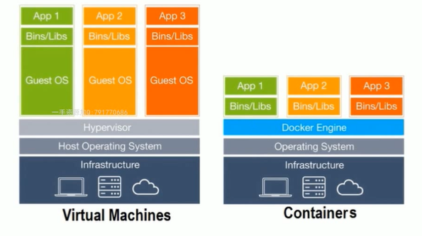

# 什么是容器技术

容器是对软件和其依赖的标准化打包，能够实现应用间的相互隔离。容器共享一个系统内核，可以在多个主流操作系统上运行。

 

容器技术解决了开发和运维的矛盾，为app提供了灵活的移植和扩展能力。


# 虚拟化和容器的区别

下图展示了虚拟化技术和容器技术的具体层级




## 从虚拟化角度

虚拟化技术通过Hypervisor对系统资源包括硬件设备进行虚拟化并对物理资源进行限定和调度。可以看见，每一个虚拟机都需要完整的操作系统，在操作系统上才是各种app。这就导致虚拟化出来的虚拟机体量比较大，启动速度慢且消耗资源多。

 

容器技术没有虚拟化这一层，其中不包含操作系统，只有app相关的依赖库，这样容器就很小巧，移植性强于虚拟化，启动速度快且消耗资源少。


## 从隔离角度


容器提供了app层面的隔离，而虚拟化提供了物理层面的隔离。


## 特性比较

从启动时间：

- 容器是秒级别启动，虚拟化启动时分钟级的；

 

从体量：

- 容器镜像通常以M为单位，虚拟机一般为G单位；
- 容器占用资源更少，部署比虚拟机快的多；

 

从性能：

- 容器共享宿主机内核，系统级虚拟化，占用资源少，没有虚拟化层级的开销，性能接近物理机；
- 虚拟机有虚拟化层级的开销，具有完整且独立的操作系统，开销大；

 

从安全性：

- 容器是进程级别的隔离，安全性不如虚拟机，容器具有访问内核的一定权限，具有一定风险；

 

从使用要求：

- 虚拟化技术要求硬件例如cpu支持虚拟化，而容器可以运行在大多数主流的操作系统上，不用考虑底层是否支持虚拟化；


# 容器技术的作用

容器技术可以有如下的作用：

·简化配置			·整合服务器	·代码流水线管理	·调试能力

·提升开发效率		·多租户		·隔离应用			·快速部署


# docker介绍

docker是容器技术的一种开源实现，其本身是一个容器引擎，docker分为docekr-ce社区版（免费）和docer-ee企业版（收费）。

 

docker是一个平台，它提供了一个开发、打包、运行app的功能，它通过docker engine可以将app和底层的基础设施隔离起来。


docker engin拥有一个后台进程dockerd，这是docker的server。docker客户端使用CLI接口，通过REST API接口和server进行通信。

docker engin主要负责对存储、镜像、容器、网络等资源进行管理。


docker早期版本基于LXC，并进一步进行封装，包括文件系统、网络互连、镜像管理等方面，极大简化了容器管理。后期移除了LXC，转为自研发的libcontainer，从1.11版本开始使用runc和libcontainerd。


# docker架构

docker是一个典型的C/S架构，包括docker server和docker client。

- docker server：守护进程，一直运行在后台内嵌有一个web server；

- docker client：docker的命令行工具，通过http协议与docker server进行通信，包含一系列子命令来管理容器和镜像；

 

当docker服务也就是docker engine接收到docker client的请求后，如果是镜像下载则自己处理，如果是创建容器则交给containerd进行处理，containerd再将请求发送给shim和runc处理。

- containerd：简单的守护进程，使用runc管理容器，向docker engine提供接口；

- shim：只负责管理一个容器；

- runc：轻量级工具，用来运行容器；


# docker依赖的内核特性

docker依赖linux内核特性：

- Namespace：命名空间
- Control groups（Cgroups）：控制组
- UnionFS：联合文件系统；

 

其中namespace提供了一种系统的资源隔离，包括文件系统、网络、进程等。docker拥有5中namespace：

- PID：进程隔离
- NET：网络隔离
- IPC：管理跨进程通信访问
- MNT：管理挂载点
- UTS：隔离内核和版本标识

 

Cgroups是linux内核提供的一种可以限制、记录、隔离物理进程组的机制，其提供了如下的功能：

·资源限制			·优先级设定

·资源计量			·资源控制

 

UnionFS是联合文件系统，支持将不同位置的目录挂载到同一个虚拟文件系统，形成一种分层的模型；

 

**docker通过这两种特性，使得每个容器都拥有自己的root文件系统，每个容器都运行在自己的进程环境中，每个容器间虚拟网络接口和ip地址都是分离的，每个容器都有独立的cpu和内存资源；**


# docker镜像image

docker image是文件（rootfs）和meta data的集合，image是分层的，并且每一层都可以通过添加、改变、删除文件来成为一个新的image。

**不同的image可以共享相同的layer（分层），image本身是read only的。**


## 查看镜像

在docker客户端可以使用如下的命令查看image：

```bash
$ docker image ls

REPOSITORY          TAG                 IMAGE ID            CREATED             SIZE
hello-world         latest              4ab4c602aa5e        3 days ago          1.84kB
```


可以看到这里有一个镜像名叫hello-world，它的大小只有2k。


## 获取镜像

直接执行 docker pull命令就是从官方的源中拉取镜像。官方源是hub.docker.com。

```bash
# 从dockerhub拉取centos最新版本镜像
$ docker pull centos
```


可以通过在官方源中建立自己的账号来完成镜像的上传和下载。除此之外，harbor可以搭建私有镜像源。

 

## 删除镜像

删除image可以使用如下的命令：

```bash
$ docker image rm <image id>
或
$ docker rmi <image id>
```


# 容器

容器是通过image创建，在image之上创建的一个可读写层container layer。image负责app的存储和分发，container负责运行app。

**容器可以类比为面向对象编程的类（image）和实例（container）**


## 列出容器

列出本地正在运行的容器可以使用如下命令：

```bash
$ docker container ls
或者
$ docker ps
```


查看所有的容器，包括正在运行的和已经结束的容器，可以使用如下命令：

```bash
$ docker container ls -a

或者

$ docker ps -a
```


## 运行容器

使用 docker run并指定一个镜像，将会启动这个镜像对应的容器。

**如果指定的image在本地不存在则会自动拉取镜像。如果一个镜像中指定的命令不是常驻内存的话，运行容器后在执行完这个命令后容器将会退出。**


容器可以交互式运行，例如：

```bash
$ docker run -it centos
```


## 删除容器

使用如下的命令可以删除所有的容器：

```bash
$ docker comtainer rm <container id>
或
$ docker rm <container id>
```


删除所有的容器可以使用如下的命令：

```bash
$ docker rm $(docker ps -aq)
```


删除已经退出的容器可以使用如下命令：

```bash
$ docker rm $(docker container ls -f “status=exited” -q)
```


## 对运行中的容器执行命令

使用exec可以在运行中的容器中执行命令，也可以通过这个方式进入运行中的容器：

```bash
$ docker exec -ti <容器ID或名称> /bin/bash
$ docker exec <容器ID或名称> ip a
```


## 启动或停止容器

```bash
$ docker stop <容器ID或名称>
$ docker start <容器ID或名称>
```

**想要进入容器的话需要 -ti 选项来分配交互终端。**


在启动容器的时候默认会为容器自动分配一个随机的名字，除非加上 --name= 来指定名字：

```bash
$ docker run -d --name=damo flask-hello-world
a4017c6232d99026ae778fdd9cacb6311ef9109e87084fd701a7afff89072243

$ docker ps 
CONTAINER ID        IMAGE                   COMMAND             CREATED             STATUS              PORTS               NAMES
a4017c6232d9        flask-hello-world   "python app.py"     3 seconds ago       Up 2 seconds        5000/tcp            damo
```


## 显示容器详细信息

inspect可以显示出容器的详细信息，内容非常丰富：

```bash
$ docker inspect a4017c6232d9

[
​    {
​        "Id": "a4017c6232d99026ae778fdd9cacb6311ef9109e87084fd701a7afff89072243",
​        "Created": "2018-09-15T08:47:43.092381201Z",
​        "Path": "python",
​	......
```


## 查看容器日志

通过log可以查看容器运行产生的日志：

```bash
$ docker logs <容器ID或名称>
```


## 内存限制

在使用 docker run的时候可以使用 --memory 和--memory-swap来进行内存限制。

>  如果指定了--memory而没有制定--memory-swap，则swap大小将和制定的memory大小一致。

 

```bash
$ docker run --memory=200M test/ubuntu-stress --vm 1 -v --vm-bytes 500M

stress: info: [1] dispatching hogs: 0 cpu, 0 io, 1 vm, 0 hdd
stress: dbug: [1] using backoff sleep of 3000us
stress: dbug: [1] --> hogvm worker 1 [8] forked
stress: dbug: [8] allocating 524288000 bytes ...
stress: dbug: [8] touching bytes in strides of 4096 bytes ...
stress: FAIL: [1] (415) <-- worker 8 got signal 9
stress: WARN: [1] (417) now reaping child worker processes
stress: FAIL: [1] (421) kill error: No such process
stress: FAIL: [1] (451) failed run completed in 2s
```

> 这里限定了容器的内存使用200M，但是stress线程要求使用内存500M，所以容器报错退出。


## cpu限制

使用 --cpu-shares可以指定cpu使用的相对权重。

 

启动两个容器，分别指定cpu的使用权重为10和5：

```bash
$ docker run --cpu-shares=10 --name=test1 test/ubuntu-stress --cpu 1
$ docker run --cpu-shares=5 --name=test2 test/ubuntu-stress --cpu 1
```

>  这样两个容器的cpu使用时间test1将会是test2的两倍。

 


# 容器网络


## 网络namespace

当运行容器后，容器将会有自己的网卡配置信息，这个叫做网络namespace。容器的网络namespace和物理机的网络namespace是隔离开的，这就实现的容器网络的隔离。

 

同一个机器上的两个容器的网络是可以ping通的。 


## 查看网络

使用如下命令可以查看当前主机上docker的网络有哪些：

```bash
$ docker network ls

NETWORK ID          NAME                DRIVER              SCOPE
3f006f541d25        bridge              bridge              local
77630a38131f        harbor_harbor       bridge              local
03b0c14d9ec5        host                host                local
27aab1e86b74        none                null                local
```


## 创建网络

使用如下命令可以创建网络：

```bash
$ docker network create -d bridge my-network

b28b877984de69a9ffb961103472a4c07ca55eb829801b00b1e80c8039e501f0

$ docker network ls

NETWORK ID          NAME                DRIVER              SCOPE
3f006f541d25        bridge              bridge              local
77630a38131f        harbor_harbor       bridge              local
03b0c14d9ec5        host                host                local
b28b877984de        my-network          bridge              local
27aab1e86b74        none                null                local
```


## 创建容器时指定network

```bash
$ docker network ls

NETWORK ID          NAME                DRIVER              SCOPE
3f006f541d25        bridge              bridge              local
77630a38131f        harbor_harbor       bridge              local
03b0c14d9ec5        host                host                local
b28b877984de        my-network          bridge              local
27aab1e86b74        none                null                local
```


现在有一个my-network的network，可以在创建容器的时候制定使用这个network：

```bash
$ docker run -d --name test3 --network my-network busybox /bin/sh -c "while true; do sleep 3600; done"
```


## 将已有容器连接到network

也可以将已有的容器连接到一个网络，例如：

```bash
$ docker network connect my-network test2

$ docker network inspect my-network

"Containers": {
​            "0697b625cb4636a568874a6e74780aeaa515d81c9144f35f0e523f47107d0c9c": {
​                "Name": "test3",
​                "EndpointID": "1fd8a2fa4c1d672408cbb56dbd12105b5274f4eedf620ae28295653ab708c85e",
​                "MacAddress": "02:42:ac:13:00:02",
​                "IPv4Address": "172.19.0.2/16",
​                "IPv6Address": ""
​            },
​            "6aa7926e8ba523e814e5d955019ce5d344b70685f5d120fa5dc9a42cab3be39d": {
​                "Name": "test2",
​                "EndpointID": "36b883030d35480c9d4d9f7bdc6b73656731ea2a62aac12061de10494ad0d666",
​                "MacAddress": "02:42:ac:13:00:03",
​                "IPv4Address": "172.19.0.3/16",
​                "IPv6Address": ""
```

> 这样相当于将test2增加了一个额外的network，而test2原先默认的network依然存在。


**如果多个容器被连接到一个用户自定义的bridge上，那么这几个容器会默认互相link，即可以使用容器名的方式连接。**


## 端口映射

一个容器默认情况下会监听容器ip的某个服务端口，例如运行下面的nginx容器：

```bash
$ docker run -d --name nginx nginx

$ docker ps

CONTAINER ID        IMAGE               COMMAND                  CREATED             STATUS              PORTS               NAMES
821e0b6f6873        nginx               "nginx -g 'daemon of…"   4 seconds ago       Up 3 seconds        80/tcp              nginx

$ docker inspect nginx
"Gateway": "172.17.0.1",
"IPAddress": "172.17.0.4",
```

>  这样运行的话nginx服务只会监听容器的172.17.0.4的80端口，外界无法访问，只能在运行容器的宿主机访问。此时需要使用端口映射。

 

例如，将容器的80端口映射到本机的1314端口可以：

```bash
$ docker run -d --name nginx -p 1314:80 nginx
```

这样，就可以通过本机的1314端口访问到容器中的服务了。


## 网络模式

