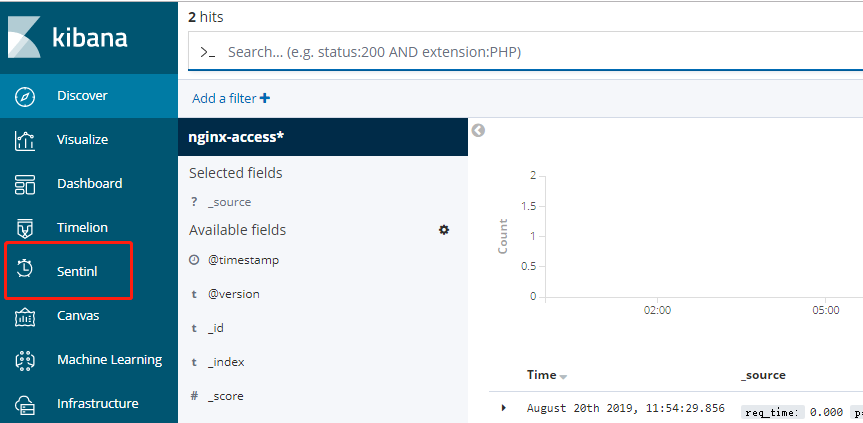
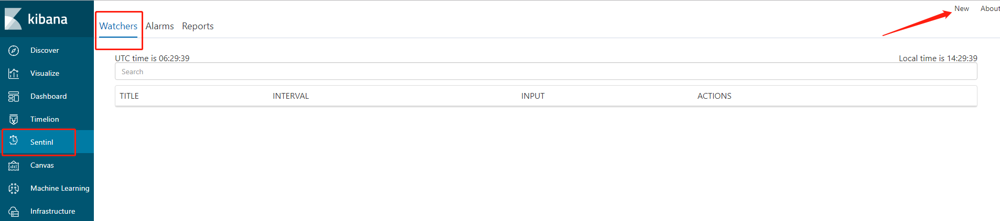
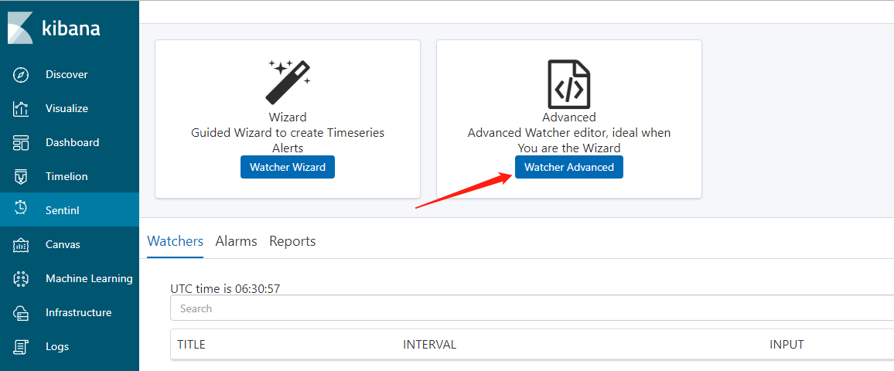

# sentinl插件

sentinl插件github地址：[sentinl github](https://github.com/sirensolutions/sentinl)

sentinl官方网站： [sentinl](https://siren.io/)


Kibana的一些数据我们有时候是想要对某些字段进行持续关注的，这时候通过报警的手段就可以大幅提升对这些信息状态了解的及时性及可靠性。使用Sentinl这个kibana开源插件，就可以帮助我们实现这个功能，对一些业务数据某些字段进行监控报警。


**注意，sentinl的版本需要和kibana版本一直，截止文章提交日期（2019年8月20）号，sentinl只支持到kibana6.6.1版本**


# 安装sentinl

## 离线安装方式

离线安装方式就要先下载好sentinl源码包，然后再使用kibana-plugin安装（这也是我这里采用的方式）：

```bash
$ ./bin/kibana-plugin install file:./root/sentinl-v6.0.1.zip

Attempting to transfer from file:./sentinl-v6.6.1.zip
Transferring 28084765 bytes....................
Transfer complete
Retrieving metadata from plugin archive
Extracting plugin archive
Extraction complete
Optimizing and caching browser bundles...
Plugin installation complete
```


## 在线安装方式

在线安装方式仅需要提供sentinl再github上的版本地址即可

```bash
$ ./bin/kibana-plugin install https://github.com/sirensolutions/sentinl/releases/download/tag-6.2.3-3/sentinl-v6.0.1.zip
```


## 创建报警规则

安装完毕后，重启kibana，会看到左边多了一个sentinl的插件




点击这个插件，添加一个新的watcher，并选择高级配置：






点击之后，设置下面的报警实例：

```json
{
  "actions": {
    "Webhook_post": {
      "name": "nginx状态码告警-测试",
      "throttle_period": "1m",
      "webhook": {
        "priority": "high",
        "stateless": false,
        "method": "POST",
        "host": "192.168.127.130",
        "port": "8000",
        "path": "/cmdb/test/kibana",
        "body": " {\"title\": \"nginx有异常日志\", \"index\": \"{{payload.hits.hits.0._index}}\", \"code\": {{payload.hits.hits.0._source.http_code}}}",
        "params": {
          "watcher": "{{watcher.title}}",
          "payload_count": "{{payload.hits.total}}"
        },
        "headers": {
          "Content-Type": "application/json"
        },
        "use_https": false
      }
    }
  },
  "input": {
    "search": {
      "request": {
        "index": [
          "nginx-access*"
        ],
        "body": {
          "query": {
            "bool": {
              "must": [
                {
                  "match": {
                    "http_code": "404"
                  }
                },
                {
                  "range": {
                    "@timestamp": {
                      "gte": "now-1m",
                      "lte": "now",
                      "format": "epoch_millis"
                    }
                  }
                }
              ],
              "must_not": []
            }
          }
        }
      }
    }
  },
  "condition": {
    "script": {
      "script": "payload.hits.total >=1"
    }
  },
  "trigger": {
    "schedule": {
      "later": "every 1 minutes"
    }
  },
  "disable": true,
  "report": false,
  "title": "post",
  "save_payload": false,
  "spy": true,
  "impersonate": false
}
```

这里是监控nginx-access*这个索引的日志，1分钟检测一次，其中match字段定义了监控项，这里是http_code字段，当出现404次数大于1的时候就会发送post请求到指定的接口，方便后续处理。


通过访问nginx不存在的域名，模拟404错误，将会向目标接口发送post请求，这样可以进行进一步处理或者接入自己的报警系统。