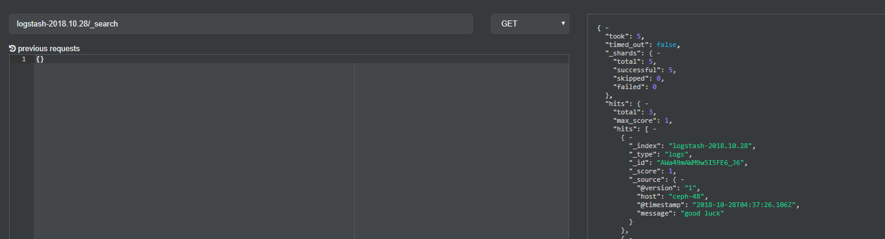
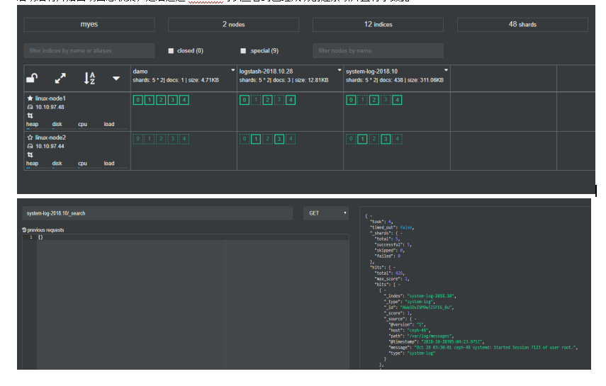

# logstash介绍

## logstash 基本概念

logstash 是一个轻量级、开源的服务器端数据处理管道，允许您从各种来源收集数据，进行动态转换，并将数据发送到您希望的目标。它最常用作 Elasticsearch 的数据管道，并和kibana结合组成elk提供日志的可视化服务。


logstash类似于信息处理的管道，数据从一端进入然后从另一端输出，logstash可以在中间对数据进行加工。实际上logstash 是用不同的线程来实现这些的。如果你运行 top 命令然后按下 H 键，你就可以看到下面这样的输出：

```bash
PID USER      PR  NI  VIRT  RES  SHR S %CPU %MEM    TIME+  COMMAND                       
21401 root      16   0 1249m 303m  10m S 18.6  0.2 866:25.46 |worker                     
21467 root      15   0 1249m 303m  10m S  3.7  0.2 129:25.59 >elasticsearch.             
21468 root      15   0 1249m 303m  10m S  3.7  0.2 128:53.39 >elasticsearch.             
21400 root      15   0 1249m 303m  10m S  2.7  0.2 108:35.80 <file                       
21403 root      15   0 1249m 303m  10m S  1.3  0.2  49:31.89 >output                     
21470 root      15   0 1249m 303m  10m S  1.0  0.2  56:24.24 >elasticsearch.
```


> logstash给每个线程都取了名字，输入的叫input，过滤的叫filter（对数据进行一定的处理），输出叫output。数据在线程之间以事件的形式流传。


**因为 logstash 可以处理多行事件所以不能称作行而要称作事件。**

 

logstash会给事件添加一些额外信息，最重要的就是 @timestamp，用来标记事件的发生时间。因为这个字段涉及到 logstash 的内部流转，所以必须是一个 joda 对象。

> 如果你尝试自己给一个字符串字段重命名为 @timestamp 的话，logstash 会直接报错。所以，请使用 filters/date 插件 来管理这个特殊字段。

 

具体实现，logstash使用FileWatch 的 Ruby Gem 库来监听文件变化。这个库支持 glob 展开文件路径，而且会记录一个叫 `.sincedb` 的数据库文件来跟踪被监听的日志文件的当前读取位置。

**sincedb 文件中记录了每个被监听的文件的 inode, major number, minor number 和 pos**


## logstash命令行参数

- -e：执行，不指定配置文件，而是将配置直接写在命令后
- -f：指定配置文件，也可以指定一个目录，这样logstash就会自动按照字母排序读取目录下所有conf文件并在内存中组合成为一个新的配置文件
- -t：检测配置文件是否能够正常解析

 

## logstash组件

- input：负责从某一地方读取数据，可以是标准输入、文件、队列等；
- filter：负责对数据进行加工，例如删除字段、添加字段、修改字段等；
- output：负责将数据输出到某一位置，可以使es、队列等；


logstash处理数据的流程也是按照 input --> filter --> output的顺序进行的。


# 从标准输入输入，从标准输出输出

logstash可以接受标准输入的内容，进行一定处理后输出到标准输出中，这种方式常用于调试，例如：

```bash
$ cd /usr/local/logstash-5.6.4/bin
$ ./logstash -e 'input { stdin{} } output { stdout{ codec => rubydebug } }'
```

> 这个命令的意思是：让logstash进入交互式模式，将标准输入的内容从标准输出显示，并将结果展示为rubydebug形式


等待logstash启动后，可以随便输入内容，例如输入hello，将会出现如下的输出：

```bash
[2018-10-28T11:42:28,030][INFO ][logstash.agent           ] Successfully started Logstash API endpoint {:port=>9600}
hello

// 以下为输出内容
{
      "@version" => "1",
          "host" => "ceph-48",
    "@timestamp" => 2018-10-28T03:42:30.195Z,
       "message" => "hello"
}
```

> 可见，logstash自己添加了一些字段在输出中


# 从标准输入输入，输出到es中

使用如下命令，将标准输入内容输出到es中。

```bash
$ ./logstash -e 'input { stdin{} } output { elasticsearch { hosts => ["10.10.97.48:9200"] index => "logstash-%{+YYYY.MM.dd}" user => "elastic" password => "changeme"} }'
```

> 如果es没有设置xpac认证，则可以去掉 user和password字段。logstash-%{+YYYY.MM.dd} 将让logstash自动创建该名称的索引。


启动之后随便输入字符例如 hehe，但是结果将不会显示在标准输出，因为输入到了es中，在cerebro中可以看到新创建的索引：


# 从标准输入输入，输出到es和标准输出中

```bash
./logstash -e 'input { stdin{} } output { stdout { codec => rubydebug } elasticsearch { hosts => ["10.10.97.48:9200"] index => "logstash-%{+YYYY.MM.dd}" user => "elastic" password => "changeme"} }'
```


等待启动有随便输入一些数据，例如123123，此时在标准输出中也可以看到输出的结果了。

```bash
123123

// 以下为输出结果
{
      "@version" => "1",
          "host" => "ceph-48",
    "@timestamp" => 2018-10-28T04:07:03.114Z,
       "message" => "123123"
}
```


而且在cerebro中，通过api查询索引下的数据，可以看到数据已经输入进es中：


# 在配置文件中定义logstash

首先在logstash的目录下创建一个conf.d的目录，用于存放logstash的配置。

```bash
$ mkdir conf.d
$ chown elastic:elastic conf.d
```


然后在这个目录中可以编辑配置文件，例如创建demo.conf文件，实现将标准输入的内容输出到标准输出和es：

```bash
$ cd conf.d
$ vim demo.conf
input {
    stdin {}
}

filter {
}

output {
    elasticsearch {
        hosts => ["10.10.97.48:9200"]
        user => "elastic"
        password => "changeme"
        index => "logstash-%{+YYYY.MM.dd}"
    }
    stdout {
        codec => rubydebug
    }
}
```

> 配置文件中一定包含input和output，filter可以没有；input和output可以有多个；每一行不需要逗号；注释使用 # 号。


然后在启动logstash的时候指定这个配置文件：

```bash
$ /usr/local/logstash-5.6.4/bin/logstash -f /usr/local/logstash-5.6.4/conf.d/demo.conf
```


在启动成功后随便输入内容，例如good luck，则在标准输出和es中呈现如下内容：

```bash
good luck

// 以下为输出内容
{
      "@version" => "1",
          "host" => "ceph-48",
    "@timestamp" => 2018-10-28T04:37:26.106Z,
       "message" => "good luck"
}
```




# 从文件中读取日志

这里让logstash收集系统日志。首先在conf.d目录下创建logstash文件system-log.conf

```bash
$ cat > system-log.conf <<EOF
input {
    file {
        path => ["/var/log/messages", "/var/log/secure"]
        type => "system-log"
        start_position => "beginning"
    }
}

filter {
}

output {
    elasticsearch {
        hosts => ["10.10.97.48:9200"]
        index => "system-log-%{+YYYY.MM}"
        user => "elastic"
        password => "changeme"
    }
}
EOF
```

> 这里在input中使用了input插件file，它可以通过 path读取一个或多个文件的内容，然后在output中将其传递给es存储。其中start_position指定了第一次读取文件的位置，beginning指定了第一次从文件头开始读取文件，也可以指定为end。


然后启动logstash：

```bash
$ /usr/local/logstash-5.6.4/bin/logstash -f /usr/local/logstash-5.6.4/conf.d/system-log.conf 
```


启动后将开始自动日志收集，之后通过cerebro可以查看到已经成功创建索引并且有了数据：




# 收集java日志

java日志有一个特点，就是java一个异常可能有多行，这样的话就需要把这个异常统一收集作为一个事件。这里就以收集es的日志/var/log/elasticsearch/myes.log为例（es是java语言编写的）。


这里的logstash配置文件以system-log.conf为基础，在其中添加判断，当收集的log文件为es时使用不同的索引：

```bash
$ cat > system-log.conf << EOF
input {
    file {
        path => ["/var/log/messages", "/var/log/secure"]
        type => "system-log"
        start_position => "beginning"
    }
    file {
        path => "/var/log/elasticsearch/myes.log"
        type => "es-log"
        start_position => "beginning"
        codec => multiline {
            pattern => "^\["
            negate => true
            what => "previous"
        }
    }
}

filter {
}

output {
    if [type] == "system-log" {
        elasticsearch {
            hosts => ["10.10.97.48:9200"]
            index => "system-log-%{+YYYY.MM}"
            user => "elastic"
            password => "changeme"
        }
    }
    if [type] == "es-log" {
        elasticsearch {
            hosts => ["10.10.97.48:9200"]
            index => "es-log-%{+YYYY.MM}"
            user => "elastic"
            password => "changeme"
        }
    }
}
EOF
```

> 在这个文件中，在es的日志输入下边，使用了multiline 这个多行插件，其中pattern定义了匹配的正则表达式，negate为true表示当匹配到这个正则表达式的时候将这一行的日志视为新的事件，what为previous表示与前一行合并。


然后启动logstash：

```bash
$ /usr/local/logstash-5.6.4/bin/logstash -f /usr/local/logstash-5.6.4/conf.d/system-log.conf
```


等待logstash启动后，在cerebro中就可以看到名为es的索引了，并且其中也有了日志数据：


# 收集nginx访问日志

先安装nginx：

```bash
$ yum install -y epel-release
$ yum clean all
$ yum install -y nginx
$ systemctl start nginx
```


将nginx日志设置为json格式，修改/etc/nginx/nginx.conf，增加下面的log配置：

```bash
log_format access_log_json '{"user_ip":"$http_x_real_ip","lan_ip":"$remote_addr","log_time":"$time_iso8601","user_req":"$request","http_code":"$status","body_bytes_sent":"$body_bytes_sent","req_time":"$request_time","user_ua":"$http_user_agent"}';
access_log  /var/log/nginx/access_log_json.log  access_log_json;
```


重新加载配置文件：

```bash
$ nginx -t 
$ nginx -s reload
```


批量请求测试：

```bash
$ ab -n 1000 -c 1 http://10.10.97.48/
$ tail -1 /var/log/nginx/access_log_json.log

{"user_ip":"-","lan_ip":"10.10.97.48","log_time":"2018-10-28T15:23:21+08:00","user_req":"GET / HTTP/1.0","http_code":"200","body_bytes_sent":"3700","req_time":"0.000","user_ua":"ApacheBench/2.3"}
```


创建相应的logstash配置：

```bash
cat > nginx.conf << EOF
input {
    file {
        path => ["/var/log/nginx/access_log_json.log"]
        codec => "json"
    }
}

filter {}

output {
    elasticsearch {
        hosts => ["10.10.97.48:9200"]
        index => "nginx-access-log-%{+YYYY.MM.dd}"
        user => "elastic"
        password => "changeme"
    }   
}
EOF
```


启动logstash：

```bash
$ /usr/local/logstash-5.6.4/bin/logstash -f nginx.conf 
```


因为在配置文件中没有设置读取文件的起始位置，所以现在没有数据也没有索引，所以要创建一些访问请求：

```bash
$ ab -n 100 -c 1 http://10.10.97.48/
```


# 使用syslog插件收集rsyslog

syslog插件默认可以监听tcp和udp的514端口，来将系统rsyslog日志收集起来。但是syslog插件的性能没有那么好（尤其是当服务器很多的时候）。

 

创建syslog.conf的logstash配置文件，让系统日志输出在标准输出和es中：

```bash
$ cat > syslog.conf << EOF
input {
    syslog {
        type => "system-syslog"
        port => 514
    }
}

filter {}

output {
    stdout {
        codec => rubydebug
    }
    elasticsearch {
        hosts => ["10.10.97.48:9200"]
        index => "system-syslog-%{+YYYY.MM}"
        user => "elastic"
        password => "changeme"
    }
}
EOF

$ /usr/local/logstash-5.6.4/bin/logstash -f syslog.conf
```


查看端口，发现syslog插件监听在514端口：

```bash
$ netstat -ntulp | grep 514

tcp6       0      0 :::514                  :::*                    LISTEN      30570/java          
udp6       0      0 :::514                  :::*                                30570/java    
```


更改系统rsyslog的配置文件最后：

```bash
vim /etc/rsyslog.conf
# 取消这一行的注释并修改ip地址，第一个*表示日志类型，第二个*表示日志级别
*.* @@10.10.97.48:514
```


重启rsyslog服务：

```bash
$ systemctl restart rsyslog
```


重启后发现日志可以在标准输出中显示出来，这说明日志可以成功收集：


如果启动了logstash后发现索引没有创建，则说明可能此时没有系统日志产生，可以使用如下的命令生成日志：

```bash
$ logger hello
```


# 收集tcp和udp日志

通常这个是用在将遗漏的日志发送到es中作为补充，将遗漏的日志放在一个文件中，然后修改索引使用nc命令发送就可以了。


创建一个tcp.conf的文件，先将日志输出在标准输出：

```bash
$ cat > tcp.conf << EOF
input {
    tcp {
        type => "tcp"
        port => "6666"
        mode => "server"
    }
}

filter {}

output {
    stdout {
        codec => rubydebug 
    }
}
EOF

$ /usr/local/logstash-5.6.4/bin/logstash -f tcp.log
```


logstash已经监听在6666端口：

```bash
$ netstat -tunlp | grep 6666

tcp6       0      0 :::6666                 :::*                    LISTEN      31738/java
```


此时，logstash就监听在tcp的6666端口，此时使用tcp向这个端口发送日志就可以被收集，例如使用nc命令：

```bash
$ echo "hello world" | nc 10.10.97.48 6666
$ nc 10.10.97.48 6666 < /etc/resolv.conf
```


此时在标准输出上就能看见收集到的日志：


# filter插件grok收集apache日志

grok可以对收集进来的数据进行拆分、更改、添加字段等。例如收集apache日志的时候，需要使用grok进行日志拆分，因为apache日志不支持json格式。


grok工作原理是根据正则表达式进行查分，其提供了一些预定义的正则表达式。

**grok会影响logstash处理日志的效率，一般先将日志原封不动输入到redis中，然后通过python等脚本进行日志拆分。**


首先安装一个apache：

```bash
$ yum install -y httpd
$ systemctl start httpd
```


创建httpd.conf的配置文件，从标准输入输入apache日志，测试grok能否将日志拆分并显示在标准输出：

```bash
cat > httpd.conf << EOF
input {
    file {
        path => "/var/log/httpd/access_log"
        start_position => "beginning"
    }
}

filter {
    grok {
        match => { "message" => "%{COMBINEDAPACHELOG}" }
    }
}

output {
    elasticsearch {
        hosts => ["10.10.97.48:9200"]
        index => "apache-accesslog-%{+YYYY.MM.dd}"
        user => "elastic"
        password => "changeme"
    }
}
EOF

/usr/local/logstash-5.6.4/bin/logstash -f httpd.conf
```


# 配置实例

```bash
input {
    file {
        path => "/var/log/httpd/access_log"
        start_position => "beginning"
		type => "apache-accesslog"
    }
    file {
        path => "/var/log/elasticsearch/myes.log"
        type => "es-log"
        start_position => "beginning"
        codec => multiline {
            pattern => "^\["
            negate => true
            what => "previous"
        }
    }
}

filter {}

output {
    if [type] == "apache-accesslog" {
	    redis {
            host => "10.10.97.48"
			port => "6379"
			db => "6"
			data_type => "list"
			key => "apache-accesslog"
		}
	}
    if [type] == "es-log" {
	    redis {
            host => "10.10.97.48"
			port => "6379"
			db => "6"
			data_type => "list"
			key => "es-log"
		}
	}
}
```

