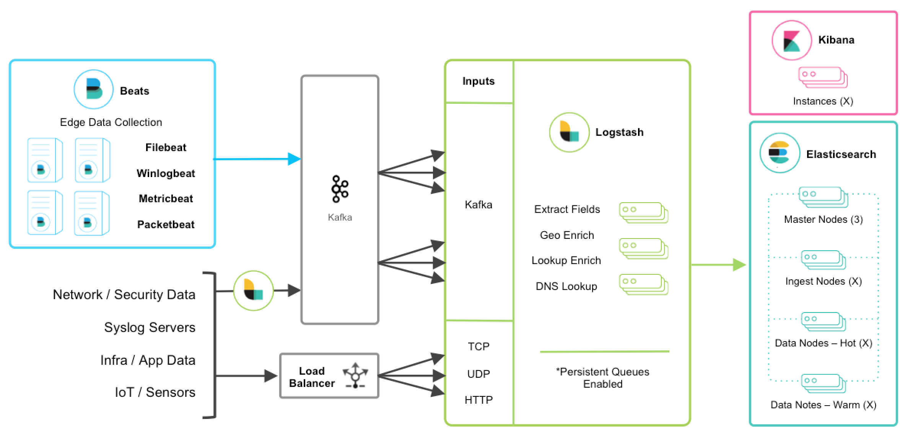

# 使用消息队列架构

在收集日志的时候，不直接将日志数据写入es中，而是先写入消息队列，不进行任何数据处理，然后在让logstash从消息队列中读取数据并进行相关的处理，然后存入es中。

 

这样的好处是可以减轻logstash的压力，并且让每一层分工更加明确。后面对消息队列中的日志进行处理的logstash可以替换为python等程序，实现了松耦合。

 

logstash支持的常见消息队列包括：rabbitmq、kalfka、redis等。





# 使用redis作为消息队列

使用logstash或者filebeat收集日志，并将日志原封不动写入redis中，然后另一个logstash再从redis中读取日志信息并通过filter进行处理，将处理的结果存入es中。


首先安装并配置一个redis：

```bash
$ yum install -y redis
$ vim /etc/redis.conf
# 将redis设置运行在后台
daemonize yes
# 修改监听的ip地址
bind 10.10.97.48
```


启动redis：

```bash
$ systemctl start redis
$ netstat -tnlp | grep 6379
tcp        0      0 10.10.97.48:6379        0.0.0.0:*               LISTEN      5676/redis-server 1 
```


然后创建一个名为redis.conf的logstash配置文件，将日志输送到redis中：

```bash
cat > redis.conf << EOF
input {
    stdin {}
}

filter {
}

output {
    redis {
        host => "10.10.97.48"
        port => "6379"
        db => "6"
        data_type => "list"
        key => "demo"
    }
}
EOF
```

>  其中host和port指定了redis的主机和端口，db指定了使用redis的db，data_type是数据类型，key指定了数据的key。


启动logstash：

```bash
$ /usr/local/logstash-5.6.4/bin/logstash -f redis.conf
```


然后在logstash的交互界面，随便输入一些内容，之后进入redis中查看，将会在db6中创建key：

```bash
$ redis-cli -h 10.10.97.48 -p 6379

10.10.97.48:6379> info
...
# Keyspace
db0:keys=1,expires=0,avg_ttl=0
db6:keys=1,expires=0,avg_ttl=0
10.10.97.48:6379> select 6
OK

10.10.97.48:6379[6]> keys *
1) "demo"

10.10.97.48:6379[6]> type demo
list

10.10.97.48:6379[6]> llen demo
(integer) 3

10.10.97.48:6379[6]> lindex demo -1
"{\"@version\":\"1\",\"host\":\"ceph-48\",\"@timestamp\":\"2018-11-04T09:56:31.393Z\",\"message\":\"dadwqwq\"}"
```

> 可见，在db6中创建了一个key名叫demo，并且这个key的类型为list，其长度为3行（因为在logstash中输入了三行），并且可以查看到一行的内容


现在可以创建收集apache的日志的文件，让其将apache日志输入到redis中：

```bash
$ cat > redis.conf << EOF
input {
    file {
        path => "/var/log/httpd/access_log"
        start_position => "beginning"
    }
}

filter {
}

output {
    redis {
        host => "10.10.97.48"
        port => "6379"
        db => "6"
        data_type => "list"
        key => "apache-accesslog"
    }
}
EOF
```


启动logstash：

```bash
$ /usr/local/logstash-5.6.4/bin/logstash -f redis-httpd.conf
```


在启动之后，访问几次httpd服务以产生日志，然后在redis中查看key可以发现新的apache的key已经创建：

```bash
10.10.97.48:6379[6]> keys *
1) "demo"

10.10.97.48:6379[6]> keys *
1) "apache-accesslog"
2) "demo"

10.10.97.48:6379[6]> lindex apache-accesslog -1
"{\"@version\":\"1\",\"host\":\"ceph-44\",\"path\":\"/var/log/httpd/access_log\",\"@timestamp\":\"2018-11-04T10:05:29.572Z\",\"message\":\"192.168.70.198 - - [04/Nov/2018:18:05:28 +0800] \\\"GET / HTTP/1.1\\\" 304 - \\\"-\\\" \\\"Mozilla/5.0 (Windows NT 10.0; WOW64) AppleWebKit/537.36 (KHTML, like Gecko) Chrome/70.0.3538.77 Safari/537.36\\\"\"}"

10.10.97.48:6379[6]> llen apache-accesslog
(integer) 8
```


在redis中已经有了数据，现在需要另起一个logstash，从redis中读取数据，使用grok处理apache日志并写入es：

```bash
$ cat > read-from-redis.conf << EOF
input {
    redis {
        host => "10.10.97.48"
        port => "6379"
        db => "6"
        data_type => "list"
        key => "apache-accesslog"
    }
}

filter {
    grok {
        match => { "message" => "%{COMBINEDAPACHELOG}" }
    }
}

output {
    elasticsearch {
        hosts => ["10.10.97.48:9200"]
        index => "apache-accesslog-redis-%{+YYYY.MM.dd}"
        user => "elastic"
        password => "changeme"
    }
}
EOF
```


启动logstash：

```bash
$ /usr/local/logstash-5.6.4/bin/logstash -f read-from-redis.conf
```


此时，在redis中可以发现，队列为空了，数据已经存入es：

```bash
10.10.97.48:6379[6]> llen apache-accesslog
(integer) 0

10.10.97.48:6379[6]> keys *
1) "demo"
```

