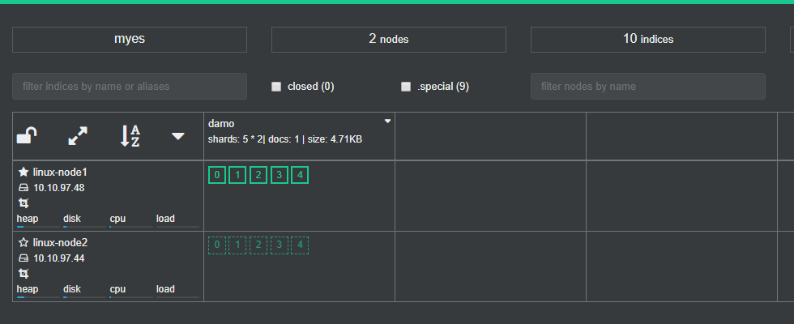
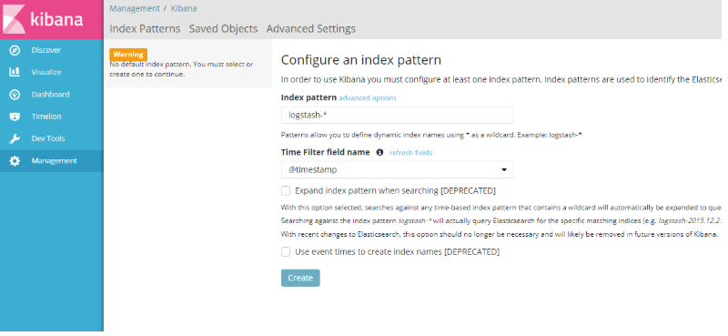

# 部署Elasticsearch

## 安装jdk

```bash
$ yum install -y java
$ java -version
openjdk version "1.8.0_181"
OpenJDK Runtime Environment (build 1.8.0_181-b13)
OpenJDK 64-Bit Server VM (build 25.181-b13, mixed mode)
```


## 下载es安装包

```bash
$ wget https://artifacts.elastic.co/downloads/elasticsearch/elasticsearch-5.6.3.tar.gz --no-check-certificate 
```


## 安装es

```bash
$ tar zxf elasticsearch-5.6.3.tar.gz
$ mv elasticsearch-5.6.3 /usr/local/
```


## 添加es用户

```bash
$ useradd elastic -p elastic
$ chown -R elastic:elastic  /usr/local/elasticsearch-5.6.3
```


## 配置es

es主要的配置文件有：

- elasticsearch.yml：主配置文件
- jvm.options：jvm相关参数
- log4j2.properties：日志配置相关参数


首先更改主配置文件 /usr/local/elasticsearch-5.6.3/config/elasticsearch.yml 文件，修改如下的内容：

```bash
# es集群名称，es通过clustername判断是否为同一个集群
cluster.name: myes		
# es节点名称，不指定则随机分配 
node.name: linux-node1
# es数据存放目录（多个的话使用逗号分隔，elastic用户需要有权限）
path.data: /data/es-data
# es日志存放目录（elastic用户需要有权限）
path.logs: /var/log/elasticsearch
# 允许es进程锁住内存不使用交换分区（保证性能）
bootstrap.memory_lock: true
# 监听的网络地址
network.host: 10.10.97.48
# 监听端口
http.port: 9200
```


编辑 /usr/local/elasticsearch-5.6.3/config/jvm.options文件修改如下内容，设置内存相关配置，根据实际情况调整：

```bash
-Xms4g
-Xmx4g
```

> -Xms2g和-Xmx2g：jvm默认的需要内存2G，如果服务器内存不足2G将导致启动失败，可以修改这里为合适的内存大小


## 设置系统参数

```bash
$ vim /etc/security/limits.conf
# 添加如下内容
* soft nofile 65536
* hard nofile 131072
* soft nproc 2048
* hard nproc 4096
* soft memlock unlimited
* hard memlock unlimited

$ echo "vm.max_map_count=262144" > /etc/sysctl.conf
$ sysctl -p
```


## 用户权限更改

```bash
$ mkdir -p /data/es-data /var/log/elasticsearch
$ chown -R elastic:elastic /data/es-data /var/log/elasticsearch
```


## 启动es

```bash
$ su - elastic
$ cd /usr/local/elasticsearch-5.6.3/bin
$ ./elasticsearch
# 看见最后有一个 stared 说明es启动了，将会停留在交互页面。
```


也可以使用下面的命令让es运行在后台：

```bash
$ su - elastic
$ cd /usr/local/elasticsearch-5.6.3/bin
$ ./elasticsearch -d 
```


## 验证es

访问本机的9200端口，如果出现类似下面的内容则说明成功运行：


在命令行执行curl请求查看es中有多少数据：

```bash
$ curl -i -XGET 'http://10.10.97.48:9200/_count?'

HTTP/1.1 200 OK
content-type: application/json; charset=UTF-8
content-length: 71
{"count":0,"_shards":{"total":0,"successful":0,"skipped":0,"failed":0}}
```


## 安装cerebro（可选）

cerebro是kopf的替代品，是用来管理es的一个工具。

```bash
$ wget https://github.com/lmenezes/cerebro/releases/download/v0.7.2/cerebro-0.7.2.tgz
$ tar zxf cerebro-0.7.2.tgz
$ cd cerebro-0.7.2/bin
$ ./cerebro
```

> 通过浏览器访问9000端口即可进入cerebro首页，首先需要输入es的地址。如果不想每次登陆都输入es地址，可以在配置文件中添加es节点。


## es集群简单配置

在准备另一台机器（10.10.97.44）并按照上边安装配置es的方法重新安装并启动一台es。

在新加的这台节点的es配置文件中，修改组播为单播方式（因为我测试组播没有成功），修改elasticsearch.yml文件的如下内容：

```bash
# 只需要修改新加入集群的节点
discovery.zen.ping.unicast.hosts: ["10.10.97.48", "10.10.97.44"]
```

> 在es集群中，节点通过在网络中查找配置cluster.name为相同名称的节点，并且节点间通过选举产生主节点，主节点将负责管理集群状态。此时访问cerebro页面将看到两个节点的集群：


此时cerebro中的集群情况如下：



> 其中节点名称前面有实心五角星的为主节点。

此时任意关闭一个节点都不会影响数据完整性。在数据请求的时候，不论连接到哪个节点，该节点都会负责将待请求的数据收集过来并发送给用户。


# 安装logstash

## 下载logstash安装包

```bash
$ wget https://artifacts.elastic.co/downloads/logstash/logstash-5.6.4.tar.gz
```


## 解压并设置权限

```bash
$ tar zxf logstash-5.6.4.tar.gz
$ mv logstash-5.6.4 /usr/local/
$ chown -R elastic:elastic /usr/local/logstash-5.6.4/
```


# 安装kibana

## 下载安装包

```bash
$ wget https://artifacts.elastic.co/downloads/kibana/kibana-5.6.3-linux-x86_64.tar.gz
```


## 解压并设置权限

```bash
$ tar zxf kibana-5.6.3-linux-x86_64.tar.gz 
$ mv kibana-5.6.3-linux-x86_64 /usr/local/kibana-5.6.3
$ chown -R elastic:elastic /usr/local/kibana-5.6.3/
```


## 配置kibana

配置文件在config下名叫kibana.yml，需要修改这个配置文件的如下内容：

```bash
# 监听的端口
server.port: 5601
# 监听的地址
server.host: "0.0.0.0"
# es的地址和端口
elasticsearch.url: "http://10.10.97.48:9200"
# kibana的自己的索引（保存配置）
kibana.index: ".kibana"
# es的用户名密码(es没有设置认证可以不用)
elasticsearch.username: "elastic"
elasticsearch.password: "changeme"
```


## 启动kibana并创建索引

下面的命令可以启动kibana：

```bash
$ /usr/local/kibana-5.6.3/bin/kibana
```


通过浏览器访问5601端口将进入kibana的主界面：




这里kibana需要用户先设置一个索引，这里我选择了Use event times to create index names 来让kibana根据时间时间匹配索引，结果如下：


点击 create就可以完成索引的创建。还可以添加一个系统日志索引，方法一样。


## 在kibana中查看日志

点击右侧的 Discover来查看索引下的日志信息进行索引的选择。通过调节右上角的时间范围可以过滤出该时间段内的日志信息。


