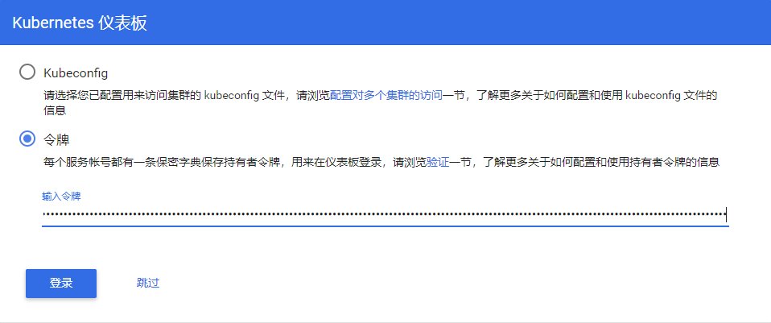
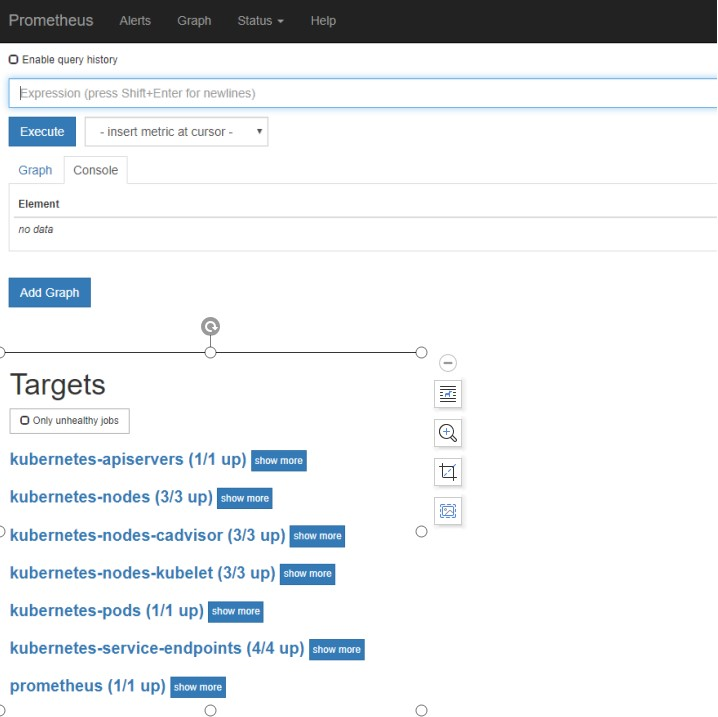
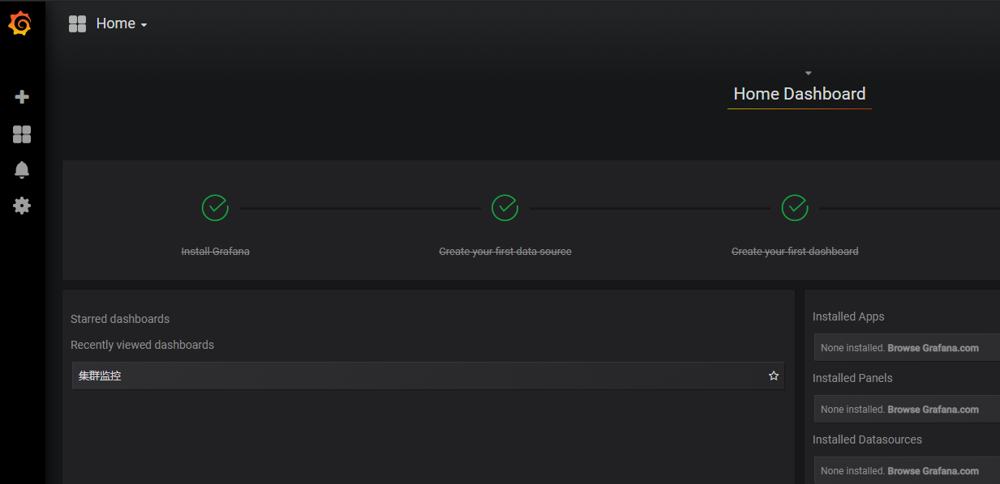

# 部署dashboard

dashboard是kubernetes下一个web可视化交互管理页面，提供了对k8s资源的可视化管理。


## 文件准备

相关yaml文件可以在yaml/dashboard下找到，这里也提供了dashboard证书，在yaml/dashboard/cert下。

> dashboard使用证书的原因是：若不给dashboard提供自签证书，其通过chrome访问将提示证书问题无法访问。


## 文件修改

在 /opt/kubernetes/yaml下创建目录dashboard，并将相关yaml文件下载到该目录中。

- dashboard-configmap.yaml：项目配置；
- dashboard-controller.yaml：项目控制器；
- dashboard-rbac.yaml：权限配置；
- dashboard-secret.yaml：秘钥配置；
- dashboard-service.yaml：服务配置；

 

修改dashboard-controller.yaml文件中的镜像image为国内源镜像：registry.cn-hangzhou.aliyuncs.com/google_containers/kubernetes-dashboard-amd64:v1.10.0

修改dashboard-service.yaml文件，在spec下增加service类型为nodeport，这样可以通过节点访问：type: NodePort

修改dashboard-rbac.yaml中权限配置，默认权限不足，将RoleBinding改为ClusterRoleBinding，将roleRef下的kind改为ClusterRole，将name改为cluster-admin

 

## 创建dashboard管理员

创建k8s-admin.yaml文件，设置dashboard管理员

```bash
$ cat > k8s-admin.yaml << EOF
apiVersion: v1
kind: ServiceAccount
metadata:
  name: dashboard-admin
  namespace: kube-system
---
kind: ClusterRoleBinding
apiVersion: rbac.authorization.k8s.io/v1beta1
metadata:
  name: dashboard-admin
subjects:
  - kind: ServiceAccount
    name: dashboard-admin
    namespace: kube-system
roleRef:
  kind: ClusterRole
  name: cluster-admin
  apiGroup: rbac.authorization.k8s.io
EOF
```


## 修改dashboard-secret.yaml文件

可以使用我提供的证书，如果想自己生成，则使用如下命令

```bash
$ openssl genrsa -des3 -passout pass:x -out dashboard.pass.key 2048
$ openssl rsa -passin pass:x -in dashboard.pass.key -out dashboard.key
$ openssl req -new -key dashboard.key -out dashboard.csr
$ openssl x509 -req -sha256 -days 365 -in dashboard.csr -signkey dashboard.key -out dashboard.crt
$ mv dashboard.key dashboard.crt /opt/kubernetes/cert
```


然后修改dashboard-secret.yaml文件，这里先获取到这里两个证书的秘钥

```bash
$ kubectl create secret generic helloworld-tls --from-file=/opt/kubernetes/cert/dashboard.crt --from-file=/opt/kubernetes/cert/dashboard.key --dry-run -o yaml

# 获取到其中的data部分，如果使用我提供的证书，复制下面的部分即可
data:
  dashboard.crt: LS0tLS1CRUdJTi...
  dashboard.key: LS0tLS1CRUdJT...
```

> 输出内容太长省略


修改dashboard-secret.yaml文件，在kubernetes-dashboard-certs这个secret下添加上面的证书秘钥

```bash
apiVersion: v1
kind: Secret
metadata:
  labels:
    k8s-app: kubernetes-dashboard
    # Allows editing resource and makes sure it is created first.
    addonmanager.kubernetes.io/mode: EnsureExists
  name: kubernetes-dashboard-certs
  namespace: kube-system
type: Opaque
<这里替换为上边的内容>
```


## 部署

```bash
$ cd /opt/kubernetes/yaml/dashboard/
$ kubectl apply -f .
```


## 检查

检查资源运行情况

```bash
$ kubectl get pod -o wide -n kube-system

NAME                                    READY   STATUS    RESTARTS   AGE    IP            NODE         NOMINATED NODE   READINESS GATES
kubernetes-dashboard-785f8ff65c-h2hhl   1/1     Running   0          5m5s   172.21.34.2   10.10.62.5   <none>           <none>

$ kubectl get svc -n kube-system
NAME                   TYPE       CLUSTER-IP      EXTERNAL-IP   PORT(S)         AGE
kubernetes-dashboard   NodePort   172.24.169.58   <none>        443:30866/TCP   88s
```

> 这里显示dashboard访问端口为node节点的30866端口。


获取登陆token在登陆的时候使用

```bash
$ kubectl get secret -n kube-system | grep dashboard-token
kubernetes-dashboard-token-92l5k                 kubernetes.io/service-account-token   3      28m

$ kubectl describe secret kubernetes-dashboard-token-92l5k -n kube-system
# 获取其中的token值并复制
```


在浏览器访问任意node节点ip的30866端口，例如：https://10.10.62.3:30866，将会进入如下的界面，选择令牌，粘贴进token并点击登录即可。


# 部署coredns

Kubernetes集群推荐使用Service Name而不是service ip作为服务的访问地址，因此需要一个Kubernetes集群范围的DNS服务实现从Service Name到Cluster Ip的解析，从Kubernetes 1.11开始，可使用CoreDNS作为Kubernetes的DNS插件进入GA状态，Kubernetes推荐使用CoreDNS作为集群内的DNS服务。kube-dns也是可选的。

 

## 文件准备

yaml配置文件可以在 yaml/coredns中找到。


## 修改yaml文件

需要修改文件的如下内容（根据自身集群情况）：

- 将第67行的cluster.local改成自己集群规划的域名后缀
- 修改115行的镜像地址为image: coredns/coredns:1.2.6（默认的镜像仓库国内无法下载）
- 将180行的clusterIP: 172.24.0.2改成规划的集群dns service的地址（可以在kubelet配置文件中看到指定的dns service地址）


## 部署coredns

执行下面的命令部署coredns

```bash
$ kubectl create -f coredns.yaml
```


## 检查

查看pod运行状态，确保服务运行正常

```bash
$ kubectl get pod -n kube-system
NAME                                    READY   STATUS    RESTARTS   AGE
coredns-dc8bbbcf9-r6nf6                 1/1     Running   0          52s

$ kubectl get svc -n kube-system
NAME                   TYPE        CLUSTER-IP      EXTERNAL-IP   PORT(S)         AGE
kube-dns               ClusterIP   172.24.0.2      <none>        53/UDP,53/TCP   2m11s
```


## 测试dns

首先在命令行启动并进入到一个测试pod中

```bash
$ kubectl run -ti --image=busybox:1.28.4 --rm --restart=Never sh
```


目前我已有的service（除过dns服务）是dashboard，其svc名称为kubernetes-dashboard，于是在busybox容器中检测能否通过service name解析dashboard服务。

```bash
# 查看pod内部dns配置文件已经改为core-dns的service地址
/ # cat /etc/resolv.conf 
nameserver 172.24.0.2
search default.svc.cluster.local. svc.cluster.local. cluster.local.
options ndots:5

# 解析内部kubernetes-dashboard服务，成功解析
/ # nslookup kubernetes-dashboard.kube-system.svc.cluster.local
Server:    172.24.0.2
Address 1: 172.24.0.2 kube-dns.kube-system.svc.cluster.local

Name:      kubernetes-dashboard.kube-system.svc.cluster.local
Address 1: 172.24.169.58 kubernetes-dashboard.kube-system.svc.cluster.local

# 解析外网域名，成功解析
/ # nslookup www.baidu.com
Server:    172.24.0.2
Address 1: 172.24.0.2 kube-dns.kube-system.svc.cluster.local

Name:      www.baidu.com
Address 1: 14.215.177.39
Address 2: 14.215.177.38
```

> 在集群内通过dns解析service-name时，格式为：<service-name>.<namespace>.svc.<dns域名后缀>，也可以简写为 <service-name>.<namespace>；如果是发起解析请求的pod和目标servcie在同一个namespace，那么直接使用service-name就可以解析。


# 部署ingress

ingress是集群流量的入口，提供集群内服务对外访问，支持4层和7层负载均衡，只支持基于域名的访问，支持tls，具体实现由ingress-controller完成。


## 文件准备

ingress的yaml配置文件可以在yaml/ingress/ingress下找到。mandatory.yaml是ingress控制器的yaml配置文件。


## 修改yaml文件

- 修改mandatory.yaml在211行serviceAccountName: nginx-ingress-serviceaccount上增加hostNetwork: true启用宿主机网络
- 可以将Deployment改为DaemonSet，或者增加RS的副本数；


## 创建ingress

执行如下命令创建ingress-conroller，并确保ingress服务正常启动。

```bash
$ kubectl create -f mandatory.yaml
$ kubectl get pod -n ingress-nginx -o wide 

NAME                                        READY   STATUS    RESTARTS   AGE    IP           NODE         NOMINATED NODE   READINESS GATES
nginx-ingress-controller-678df7d6c7-hwq7q   1/1     Running   0          103s   10.10.62.3   10.10.62.3   <none>           <none>
```


# 部署metrics-server

## metrics-server介绍

metrics-server是用来替代heapster的（heapster已停止维护），用于从集群中获取监控指标以及为kubectl top、hpa提供运行基础接口。

 

metrics-server像kube-apiserver一样，提供了很多api组，但它不是k8s组成部分，而是托管运行在k8s之上的Pod。为了让用户无缝的使用metrics-server当中的API，还需要把这类自定义的API，通过聚合器聚合到核心API组里，然后可以把此API当作是核心API的一部分，通过kubectl api-versions可直接查看。

 

metrics-server收集指标数据的方式是从各节点上kubelet提供的Summary API 即10250端口收集数据，收集Node和Pod核心资源指标数据，主要是内存和cpu方面的使用情况，并将收集的信息存储在内存中，所以通过kubectl top不能查看资源数据的历史情况，其它资源指标数据则通过prometheus采集了。


## 获取配置文件

metrics-server的相关配置yaml文件可以在yaml/mtrics-server中找到。


## 修改apiserver配置

在前边部署apiserver时已经将下列参数加入apiserver配置文件中，这里再解释一下

```bash
--requestheader-client-ca-file=/opt/kubernetes/cert/ca.pem 
--requestheader-username-headers=X-Remote-User 
--requestheader-group-headers=X-Remote-Group 
--requestheader-extra-headers-prefix=X-Remote-Extra- 
--requestheader-allowed-names=""
--proxy-client-key-file=/opt/kubernetes/cert/st01009vm2-key.pem 
--proxy-client-cert-file=/opt/kubernetes/cert/st01009vm2.pem 
--enable-aggregator-routing=true
--runtime-config=api/all
```

- --requestheader-XXX、--proxy-client-XXX 是 kube-apiserver 的 aggregator layer 相关的配置参数，metrics-server & HPA 需要使用；
- --requestheader-client-ca-file：用于签名 --proxy-client-cert-file 和 --proxy-client-key-file 指定的证书；在启用了 metric aggregator 时使用；
- 如果 --requestheader-allowed-names 不为空，则--proxy-client-cert-file 证书的 CN 必须位于 allowed-names 中，默认为 aggregator，这里让其匹配所有名称；

> 上边的参数已在部署apiserver时添加，后面添加的话记得重启kube-apiserver


## 创建metrics-server

执行下面的命令创建metrics-server

```bash
$ kubectl create -f .
$ kubectl get pod -n kube-system | grep metrics

metrics-server-v0.3.1-dd974554-bwh4z    2/2     Running   0          36s
```


## 测试

创建完成后，待pod运行成功，执行下面的命令测试metrics-server是否成功运行

```bash
$ kubectl top node 

NAME         CPU(cores)   CPU%   MEMORY(bytes)   MEMORY%   
10.10.62.3   44m          1%     1961Mi          53%       
10.10.62.4   37m          0%     2118Mi          57%       
10.10.62.5   35m          0%     2259Mi          61%
```

> 可以成功获取到资源的使用情况了，说明metrics-server运行成功。


## 排错

如果运行top命令的时候出现报错

```bash
Error from server (Forbidden): nodes.metrics.k8s.io is forbidden: User "kubernetes" cannot list nodes.metrics.k8s.io at the cluster scope
```


那么需要执行如下命令绑定权限

```bash
kubectl create clusterrolebinding kubernetes-clusteradmin-binding --clusterrole=cluster-admin --user=kubernetes
```


# 集群监控

## 集群监控指标

对k8s集群进行监控，主要分为两大块：

- 集群资源监控：
  - 集群资源使用率监控；
  - 节点状态监控；
  - 运行pod监控；
  - ...
- pod监控：
  - kubernetes指标监控；
  - 容器指标监控；
  - 应用程序监控；


## 监控解决方案

- zabbix：老牌监控工具，支持报警，可进行大量订制，适合绝大多数场景；
- open-falcon：支持告警，功能模块更细，更复杂，适合应用程序和系统监控；
- cadvisor+influxdb+grafana：支持告警，简单易用，适合于容器监控；
- prometheus+grafana：扩展性好，图形界面优秀，可自定义监控图表，适合主机、服务和容器，社区推荐；

> 这里我采用的就是 prometheus+grafana的方案。


## 使用exporter+prometheus+grafana监控集群

- exporter：负责收集监控指标；
- prometheus：时序数据库，存储监控数据；
- grafana：绘制展示图表；

> 所有的yaml文件和grafana模板都可以在yaml/plmxs下找到。


首先执行下面的命令创建node-exporter：

```bash
$ kubectl create -f node-exporter-ds.yaml
$ kubectl create -f node-exporter-service.yaml
$ kubectl get pod,svc -n kube-system | grep node-exporter

pod/node-exporter-78f6m                     1/1     Running   0          4h5m
pod/node-exporter-d44lz                     1/1     Running   0          4h5m
pod/node-exporter-zzqpr                     1/1     Running   0          4h5m
service/node-exporter          ClusterIP   172.24.28.23     <none>        9100/TCP         2s
```


执行下面的命令创建prometheus：

```bash
$ kubectl create -f prometheus-rbac.yaml
$ kubectl create -f prometheus-configmap.yaml
$ kubectl create -f prometheus-statefulset.yaml
$ kubectl create -f prometheus-service.yaml
$ kubectl create -f prometheus-nodeport-service.yaml
$ kubectl create -f prometheus-ingress.yaml
$ kubectl get pod,svc,ingress,cm -n kube-system | grep prometheus

pod/prometheus-0                            2/2     Running   0          76m
service/prometheus             ClusterIP   172.24.91.1      <none>        9090/TCP         161m
service/prometheus-nodeport    NodePort    172.24.222.231   <none>        9090:30003/TCP   15m
ingress.extensions/prometheus   prometheus.example.com             80      176m
configmap/prometheus-config        
```


执行下面的命令创建grafana：

```bash
$ kubectl create -f grafana-deploy.yaml
$ kubectl create -f grafana-service.yaml
$ kubectl create -f grafana-ingress.yaml
$ kubectl get pod,svc,ingress -n kube-system | grep grafana

pod/grafana-core-7f9b7bc5bf-pd95l           1/1     Running   0          29m
service/grafana                ClusterIP   172.24.92.91     <none>        3000/TCP         25m
ingress.extensions/grafana      grafana.example.com                80      24m
```


## 访问测试

首先测试prometheus，从浏览器访问相关域名或ip，若能进入prometheus的界面则运行成功，需要确保status/targets下的所有监控项状态都为up




> 我是通过ingress访问的prometheus和grafana，也可以通过nodeport方式


然后测试grafana，默认用户名和密码为admin/admin，如果能够登陆，则grafana也正常。




之后添加相应的数据源，并导入grafana模板就可以使用了。

