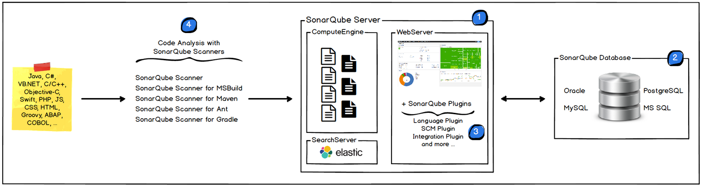
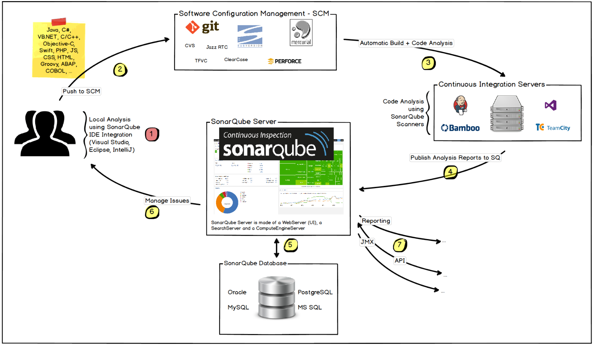

# SonarQube介绍


## 什么是SonarQube

SonarQube是开源的代码质量管理平台，可用于快速定位代码中潜在或者明显的错误，并可以通过各种开源插件进行扩展。


## SonarQube版本

SonarQube现有收费版本包括开发者版本和企业版本，两者提供更多的功能；还有一个CE版本是免费的。


## SonarQube平台组成

SonarQube平台构成如下图所示：



- SonarQube服务器：包括所有项目的配置和结果展示页面，实际有三个进程：
  - webserver：页面展示；
  - searchserver：一般使用ES作为后台搜索服务；
  - ComputeEngine：处理源码分析报告，并把报告存储到数据库中；
- SonarQube数据库：存储安全配置、全局配置、插件配置、项目质量快照、展示内容等；
- SonarQube插件：安装在服务端，包括代码语言、代码管理工具、第三方集成、账户认证等插件；
- SonarQube扫描器：运行在构建或持续集成服务器上的一个或多个扫描程序，执行项目分析任务；


> SonarQube平台只能有一个SonarQube数据库和服务器，为了保障性能可以将SonarQube每个模块安装到不同的服务器上。


## 基于SonarQube工作流




1. 本地扫描：开发者在本地IDE安装sonarLint插件，进行本地代码的实时扫描；
2. 本地代码上传：开发者通过代码管理工具（例如git）上传到代码仓库；
3. 持续构建：持续集成工具（例如jenkins）发现新的提交，触发自动构建任务，如果在持续集成工具中配置了SonarQube代码扫描选项，则每次构建都会进行扫描；
4. 上传扫描结果：持续集成工具端的扫描器执行完成，将扫描结果上传到SonarQube服务器端；
5. 展示和存储：服务器端对扫描结果进行处理，生成扫描报告并存储到数据库中，在前端进行展示，同时也可以发送邮件等；
6. 开发处理问题：开发人员查看自己代码的问题进行修改处理；


# 部署SonarQube


## 安装jdk

SonarQube依赖于openjdk11以上

```bash
 yum install -y java-11-openjdk.x86_64
 java -version
```


## 安装mysql

SonarQube默认使用自带的H2数据库，该数据库无法扩展且在升级时无法进行数据迁移，所以强烈建议在生产中使用Mysql等关系型数据库，mysql必须在5.6以上，postgreSQL在8以上。


> 这里安装mysql5.7


```bash
wget https://dev.mysql.com/get/Downloads/MySQL-5.7/mysql-5.7.26-1.el7.x86_64.rpm-bundle.tar
tar xvf mysql-5.7.26-1.el7.x86_64.rpm-bundle.tar
rpm -ivh mysql-community-common-5.7.26-1.el7.x86_64.rpm
rpm -ivh mysql-community-libs*
rpm -ivh mysql-community-client-5.7.26-1.el7.x86_64.rpm
rpm -ivh mysql-community-devel-5.7.26-1.el7.x86_64.rpm
yum install -y perl libaio libaio-devel numactl net-tools
rpm -ivh mysql-community-server-5.7.26-1.el7.x86_64.rpm
systemctl start mysqld.service
```


查看mysql日志，找到类似下面的这一行：

```bash
cat /var/log/mysql.log
[Note] A temporary password is generated for root@localhost: <wqB!ebdk6b4
```

> mysql第一次运行的时候会初始化一个root用户并设置一个随机密码，这一行可以找到这个密码


可以通过下面的命令修改root密码并删除测试数据库和匿名用户

```bash
# 设置root用户密码
$ mysqladmin -u root -p'<wqB!ebdk6b4' password Root123?
# 删除测试数据库和匿名用户
$ mysql_secure_installation
```

> mysql密码需要符合一定的密码规则，否则设置会失败


下面就可以连接mysql了：

```bash
mysql -uroot -pRoot123?
```


## 设置系统参数

在Linux环境下，需要设置如下的系统参数：

```bash
sysctl -w vm.max_map_count=262144
ulimit -n 65536
sysctl -w fs.file-max=65536
```


永久生效以上参数：

```bash
echo "vm.max_map_count = 262144" >> /etc/sysctl.conf
echo "fs.file-max = 65536" >> /etc/sysctl.conf

// 编辑/etc/security/limits.conf，增加如下的几个参数
* soft nofile 65536
* hard nofile 65536
```


修改完后重启系统。


## 创建用户

SonarQube组件中的ES不允许root用户启动，所以需要在系统中创建一个sonar用户，用于启动SonarQube进程。

```bash
adduser sonar
echo "sonar" | passwd --stdin sonar
```


## 安装SonarQube服务器

先下载zip包解压并安装，这里下载的是7.9版本的。

```bash
wget https://binaries.sonarsource.com/Distribution/sonarqube/sonarqube-7.9.zip
unzip sonarqube-7.9.zip
mv sonarqube-7.9 /usr/local/
chown -R sonar:sonar /usr/local/sonarqube-7.9/
```


## 启动SonarQube

启动服务的时候需要切换到sonar用户：

```bash
su - sonar
cd /usr/local/sonarqube-7.9/bin/linux-x86-64
./sonar.sh start
./sonar.sh status
```

> 如果启动失败可以查看log目录下的日志


启动成功后，访问本地的9000端口即可进入


# 使用mysql

SonarQube默认使用的H2数据库有种种问题，所以可以修改为mysql数据库。


## 创建数据库

通过下面的sql语句创建数据库并指定字符集：

```mysql
CREATE DATABASE IF NOT EXISTS sonar DEFAULT CHARSET utf8 COLLATE utf8_general_ci;
```


## 修改配置文件

sonar主配置文件在 `conf/sonar.properties` ，需要做如下的配置：

```bash
// 取消下面两个配置的注释并设置默认值
sonar.jdbc.username=sonaruser
sonar.jdbc.password=sonaruser123

// 添加下面连接mysql的语句
sonar.jdbc.url=jdbc:mysql://localhost:3306/sonar?useUnicode=true&characterEncoding=utf8&rewriteBatchedStatements=true&useConfigs=maxPerformance&useSSL=false
```


## 重启服务

```bash
cd /usr/local/sonarqube-7.9/bin/linux-x86-64
./sonar.sh restart
./sonar.sh status
```

