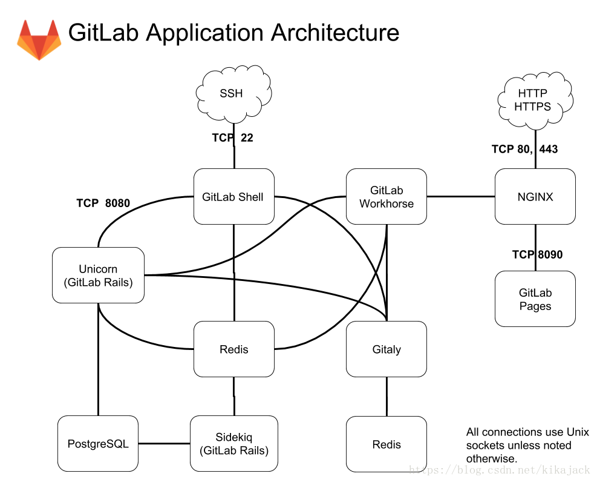
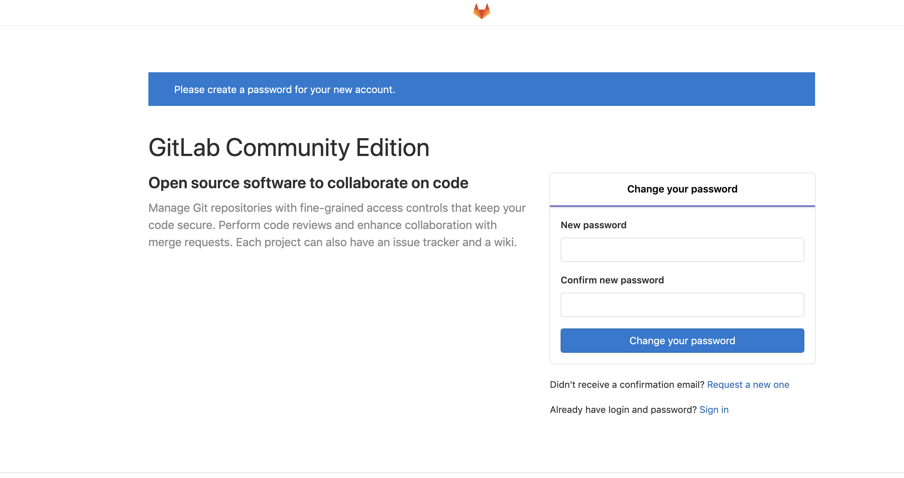

在企业中代码管理是非常重要的环节，常用的工具就是gitlab。


# gitlab介绍


## 什么是gitlab

gitlab是基于Ruby On Redis开发的，类似于github，支持在自己的服务器上搭建和配置。


## gitlab版本

gitlab目前有CE和EE两个版本：

- CE：开源版本，免费；
- EE：商业版本，收费；


CE和EE都支持基于git的项目源码管理，但是EE版本提供更强的功能和技术支持，例如代码扫描、代码提交规则指定等。


## gitlab组件

gitlab架构图如下图所示：




其中的组件如下：

1. gitlab workhorse：存储gitlab处理的内容，可以放在外置硬盘或者其他文件系统(如NFS)上；
2. nginx：用户访问的前端代理；
3. PostgreSQL：存储元数据、问题、合并请求、用户和权限等数据；
4. Redis：消息中心，包含任务列表；
5. Sidekiq：负责发送邮件(邮件任务从Redis中获取)；
6. Unicorn：通过Redis中存储的用户信息进行用户验证、对代码进行修改操作；
7. gitlab shell：从ssh前台接受用户命令；
8. gitaly：提供高层次的gitrpc服务以访问git仓库；


# 安装gitlab CE


## 安装postfix

安装并启动postfix服务，后续发送邮件需要用到：

```bash
yum install -y postfix
systemctl start postfix
systemctl enable postfix
```


## 安装openssh服务端和客户端

```bash
yum install -y openssh-server openssh-clients
systemctl start sshd
systemctl enable sshd
```


## 安装gitlab

这里从gitlab官方下载rpm包，使用的是官方提供的快速安装命令，也可以下载对应的rpm包安装：

```bash
// 配置官方yum源
curl -s https://packages.gitlab.com/install/repositories/gitlab/gitlab-ce/script.rpm.sh | bash

// yum安装，这里安装的是12.0.3的版本
yum install -y  gitlab-ce-12.0.3-ce.0.el7.x86_64
```


## 配置gitlab

安装完成后会在 `/etc/gitlab/` 下生成一个 `gitlab.rb` 的文件，需要对这个文件进行一定的修改：

```bash
// external_url为gitlab对外访问地址，包括邮件展示地址、拉去代码地址等；这里使用本机内网ip
external_url 'http://10.10.62.17/'

// 修改gitlab服务端口(因为后续的jenkins计划和gitlab安装在一台上所以要改，如果不在一台可以跳过)
unicorn['port'] = 8081
```


## 加载配置

运行下面的命令加载配置，第一次加载时间较长：

```bash
gitlab-ctl reconfigure
```


> 这个命令是gitlab用来将修改过的配置立即生效的


当最后出现下面提示时表示加载完成：

```
gitlab Reconfigured!
```


## 查看gitlab状态

通过下面的命令查看gitlab各组件的状态：

```bash
gitlab-ctl status
```


我的输出如下：

```
run: alertmanager: (pid 30606) 83s; run: log: (pid 30264) 131s
run: gitaly: (pid 30438) 86s; run: log: (pid 29657) 229s
run: gitlab-monitor: (pid 30493) 85s; run: log: (pid 30156) 149s
run: gitlab-workhorse: (pid 30466) 86s; run: log: (pid 29970) 174s
run: grafana: (pid 30632) 82s; run: log: (pid 30405) 99s
run: logrotate: (pid 30015) 164s; run: log: (pid 30069) 161s
run: nginx: (pid 29981) 170s; run: log: (pid 30001) 167s
run: node-exporter: (pid 30482) 86s; run: log: (pid 30128) 155s
run: postgres-exporter: (pid 30621) 83s; run: log: (pid 30307) 125s
run: postgresql: (pid 29741) 224s; run: log: (pid 29790) 222s
run: prometheus: (pid 30508) 84s; run: log: (pid 30220) 137s
run: redis: (pid 29584) 236s; run: log: (pid 29594) 235s
run: redis-exporter: (pid 30500) 85s; run: log: (pid 30184) 143s
run: sidekiq: (pid 29925) 182s; run: log: (pid 29940) 179s
run: unicorn: (pid 29893) 188s; run: log: (pid 29920) 185s
```


## 停止、重启gitlab

停止、启动和重启gitlab的命令如下：

```bash
gitlab-ctl stop 
gitlab-ctl start
gitlab-ctl restart
```


## 查看日志

通过下面的命令可以看到每一个组件的日志文件及其内容：

```bash
gitlab-ctl tail
```


想看某个组件的日志可以在上面命令的基础上指定组件名称，例如：

```bash
gitlabctl tail nginx
```


还可以在上面命令的基础上指定某一个日志文件，例如：

```bash
gitlab-ctl tail gitlab-rails/production_json.log
```


## 访问gitlab

前面我绑定的是内网ip，我的PC和服务器在一个内网下，所以可以直接打开浏览器输入服务器IP地址，便可以访问到gitlab了




第一次登陆时会进入这个root密码修改页面，在这里需要修改root密码。修改完成后便可以使用root用户登陆了。


# 配置gitlab


## 修改仓库存储目录

默认仓库存储位于 `/var/opt/gitlab/git-data` 下的 repositories目录，可以编辑 `gitlab.rb` 文件来修改这个路径。

```bash
// 如果没有配置，则增加下面的配置；如果有，则修改
git_data_dirs({
   "default" => {
     "path" => "/data1/git-data"
    }
 })
 
// 也可以添加多个人仓库，default是默认仓库，切换可以在界面管理员设置中修改
git_data_dirs({
   "default" => {
     "path" => "/data1/git-data"
    },
   "alternative" => {
     "path" => "/data2/git-data"
   }
 })
 
// 重新生效配置
gitlab-ctl reconfigure
```


> 需要保证系统git用户有权访问这些目录及上层目录，否则会报错


## 数据仓库迁移

修改仓库后，需要通过以下代码将旧仓库的数据迁移到新的目录下。例如这里举例将默认路径下的代码迁移到新的仓库/data1下。

```bash
// 先停止gitlab服务，防止生成新数据
gitlab-ctl stop

// 目录同步，注意repositories后面没有斜杠，而git-data后面有斜杠，如果容错会导致只同步子目录
rsync -av /var/opt/gitlab/git-data/repositories /data1/git-data/

// 版本更新(可选)
gitlab-ctl upgrade

// 检查目录结构
ls /data1/git-data

// 重启gitlab
gitlab-ctl start

// 重新载入配置
gitlab-ctl reconfigure
```


## 配置SMTP

gitlab往往需要内部的SMTP服务来发送邮件，需要修改 `gitlab.rb`文件的如下内容：

```bash
// 将如下内容修改为实际的地址即可
gitlab_rails['smtp_enable'] = true
gitlab_rails['smtp_address'] = "smtp.server"
gitlab_rails['smtp_port'] = 465
gitlab_rails['smtp_user_name'] = "smtp user"
gitlab_rails['smtp_password'] = "smtp password"
gitlab_rails['smtp_domain'] = "example.com"
gitlab_rails['smtp_authentication'] = "login"
gitlab_rails['smtp_enable_starttls_auto'] = true
gitlab_rails['smtp_tls'] = false
gitlab_rails['smtp_openssl_verify_mode'] = 'peer'

// 邮件默认发送于gitlab@localhost，不满足要求可以修改下面的参数
gitlab_rails['gitlab_email_from'] = 'gitlab-test@example.com'
gitlab_rails['gitlab_email_reply_to'] = 'gitlab@example.com'

// 重载配置
gitlab-ctl reconfigure
```

