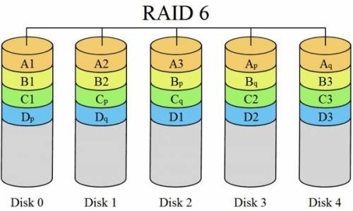
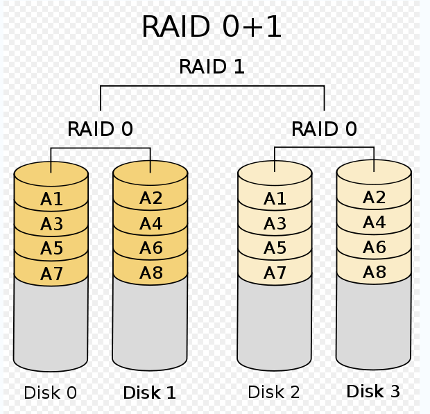
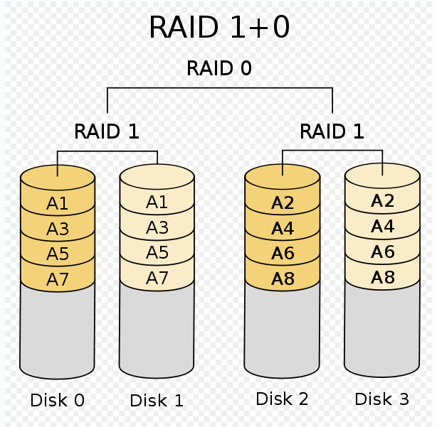

# Raid有哪些级别、区别及各自容量计算方式

## raid0

raid0特点：不校验数据，不提供数据冗余策略，将数据分散存储在所有的磁盘上。理论上读写性能是单个磁盘性能的n倍，但实际会受到总线带宽限制，所以实际会低于理论值。

> n为组成raid0的磁盘个数


raid0容量计算：可用容量 = 所有磁盘容量之和

**raid0最少需要两块盘**


## raid1

raid1特点：会对数据进行冗余处理，一旦工作磁盘发生故障，镜像磁盘会会接管，不会影响数据读写及完整性。


raid1容量计算：可用容量 = 所有磁盘容量之和 * 50%

**raid1最少需要两块盘**


## raid5

raid5特点：兼顾了存储成本、性能和安全的方案，将数据和对应的奇偶校验信息存储在各个磁盘上，并且校验信息和数据在不同的磁盘上，当磁盘损坏，就是用剩余数据和奇偶校验信息去恢复数据。


raid5容量计算：可用容量 = (n-1)/n * 所有磁盘容量之和

> n为组成raid5的磁盘个数

**raid5至少3块盘**


## raid6

RAID6是在RAID 5基础上进一步加强数据保护而设计的一种RAID方式，实际上是一种扩展RAID 5等级。与RAID 5的不同之处于除了每个硬盘上都有同级数据XOR校验区外，还有一个针对每个数据块的XOR校验区。当然，当前盘数据块的校验数据不可能存在当前盘而是交错存储的。这样一来，等于每个数据块有了两个校验保护屏障（一个分层校验，一个是总体校验），因此RAID 6的数据冗余性能相当好。但是，由于增加了一个校验，所以写入的效率较RAID 5还差，而且控制系统的设计也更为复杂，第二块的校验区也减少了有效存储空间。




raid6容量：可用容量 = (n-2)/n * 所有磁盘容量之和


## raid01和raid10

这两种属于raid级别的组合，特点如下：

- raid01：先做raid0再做raid1，有一个盘损坏，同组的盘都不能运作，可靠性低；
- raid10：先做raid1再做raid0，有一个盘损坏，剩下的盘都可以运作，可靠性高；






# 僵尸进程是如何产生的及如何解决

有一些进程完成了生命周期却还是留在系统中，这种进程称之为僵尸进程，它虽无害但是会占据系统资源。


产生原因：当运行一个程序时，会生成相应的父进程和若干子进程，子进程都会消耗内存和cpu资源。子进程结束之后会发送Exit信号到父进程，父进程会调用wait命令读取子进程的退出状态并将其从进程列表中删除。若父进程没能成功读取到子进程Exit信号，子进程仍会保留在进程列表中，称为僵尸进程。


查看僵尸进程可以执行下面的命令：

```bash
ps -aux | grep Z
```


找到僵尸进程后，需要让其父进程对其进行处理，执行下面的命令：

```bash
kill -s SIGCHLD pid
```

> pid为父进程的pid值，父进程就会删除所有以及完成并死掉的子进程了，或者干脆直接结束父进程也可以


