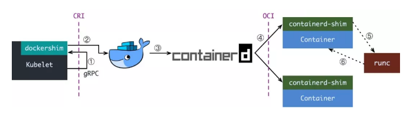
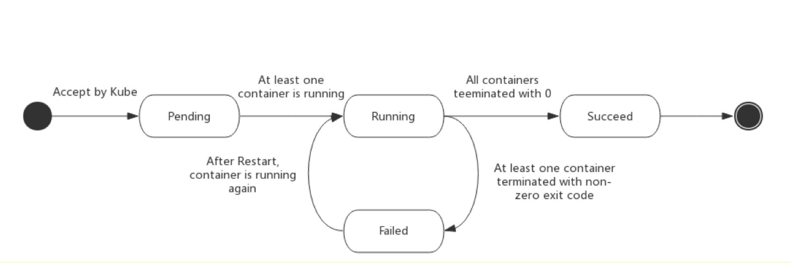

# 容器的几种网络模式和区别

**host模式**

通过参数 ```--net=host``` 指定，容器将和宿主机共享一个network namespace，容器不会获得自己的网卡和ip，而是和宿主机共享ip和端口。

> 但是容器的进程列表和文件系统等还是和宿主机隔离的。


**container模式**

通过参数 ```--net=container:NAME_OR_ID``` 指定，指定新创建的容器和已存在的容器共享一个network namespace，新创建的容器不会拥有自己的ip和端口，而是和指定的容器共享ip和端口。两个容器间的进程可以通过lo网卡进行通信。


**none模式**

通过参数 ```--net=none``` 指定，容器拥有自己的network namespace，但是不会进行任何网络配置，没有网卡、ip、路由等信息。


**brigde模式**

通过参数 ```--net=bridge``` 指定， 是默认的网络模式，会为容器分配network namespace，设置ip等，并将主机上的docker容器连接到一个虚拟网桥上。


# 构建镜像需要注意的事

- 基础镜像尽量小，例如使用alpine镜像，而不直接使用centos镜像；
- 镜像版本号不要使用latest等意义不明确的字段；
- 单个容器内尽量只运行一个进程；

 

# 容器和虚拟机的区别

- 从启动速度：虚拟机是分钟级，容器是秒级，适合快速迭代，持续集成；
- 容器是操作系统级别的虚拟化，虚拟机是内核级别的虚拟化；
- 容器消耗更少的资源，更轻量，性能更好；虚拟机由于存在虚拟化层，消耗的资源更多；
- 同样配置的物理机可以启动的容器远多于虚拟机；
- 容器是进程级别的隔离，安全性不足；虚拟机是系统级别的隔离，安全性更好；
- 容器交付快速，只需要提供dockerfile进行镜像构建即可；虚拟机交付慢；


# 什么是kubernetes及其缺陷

kubernetes是谷歌开源的容器编排平台，通过kubernetes平台可以管理运行在多个节点上的容器，其可以让部署容器变得高效简单，同时提供了应用程序的弹性伸缩、滚动更新等功能。

 

缺陷是kubernetes的部署和维护较为复杂，其本身仅提供容器编排的功能，其余的功能例如网络、容器运行时、日志收集、流量控制等都需要其他插件的支持，运维成本比较高。


# kubelet创建容器的步骤



1. kubelet通过CRI（container runtime interface 容器运行时接口，grpc协议）调用dockershim，发起创建容器的请求。dockershim已经被内置在kubelet中，所以接收该请求的也是kubelet进程；
2. dockershim将kubelet的请求转换为docker daemon能理解的请求并发送给docker daemon请求创建一个容器；
3. docker daemon的容器创建操作已经转移到containerd中，所以docker daemon将请求转发到containerd并请求创建一个容器；
4. containerd收到请求后创建一个containerd-shim的进程，containerd-shim将作为容器进程的父进程来创建并管理容器，例如收集状态、维持stdin等；
5. containerd-shim调用OCI（open container initiative，开放容器标准）的一个参考实现runC工具来进行设置namespace、cgroups、挂载rootfs等操作，启动容器；
6. 容器启动后runC退出，containerd-shim成为容器的父进程，负责收集容器状态并上报给containerd，并在容器中pid为1的进程退出后清理子进程确保没有僵尸进程出现；


# kubernetes创建pod的流程

1. kube-apiserver接收到用户的请求后，生成包含创建信息的yml并存入etcd；
2. kube-scheduler发现新的资源请求，进行调度计算，找到合适的node，并将选定的node信息更新到yml中；
3. kubelet监控到etcd中有新的pod，开始创建pod资源并监控上报pod信息到apiserver


# kubrnetes的组件

kubernetes有如下的一些主要组件：

- kubectl：客户端命令工具，调用kube-apiserver接口管理集群；
- kube-apiserver：以REST API服务形式提供接口，作为整个系统的控制入口；
- kube-controller-manager：执行整个系统的后台任务，包括节点状态状况、Pod个数、Pods和Service的关联等；
- kube-scheduler：负责节点资源管理，接收来自kube-apiserver创建Pods任务，并分配到某个节点；
- kube-proxy：运行在每个计算节点上，负责Pod网络代理。定时从etcd获取到service信息来做相应的策略；
- kubelet：运行在每个计算节点上，作为agent，接收分配该节点的Pods任务及管理容器，周期性获取容器状态，反馈给kube-apiserver；

 

其他重要组件：

- etcd：负责节点间的服务发现和配置共享；
- kube-dns（coredns）：集群内dns服务；
- flannel：集群网络打通；


# 容器编排的价值和好处

容器化是现在应用发展的方向，而微服务架构则是运维架构体系发展的重要方向。容器编排也就是微服务化适合于应用程序的持续迭代，可以和CICD进行完美的结合，加速业务的发展，使得开发人员更专注于代码的开发。

使用kubernetes进行容器编排的话，我们就可以很快的进行应用程序的部署和更新，在流量增大的时候进行快速的扩容，而不必像以往单体服务模式下去关心服务器资源和环境。


# Pod亲和性作用是什么

亲和性分为nodeAffinity（主机亲和性），podAffinity（POD亲和性）以及podAntiAffinity（POD反亲和性）。

- nodeAffinity（主机亲和性）是pod和主机的关系，解决pod可以运行在哪些主机和pod不能运行在哪些主机的问题；例如将服务部署在指定标签的node上；

- podAffinity（POD亲和性）解决POD可以和哪些POD部署在同一个拓扑域中的问题（拓扑域用主机标签实现，可以是单个主机，也可以是多个主机组成的cluster、zone等。）

 

# 什么是Init Container，什么是pause容器

Init Container是初始化容器，即在pod中主容器启动之前，第一个启动的容器，它可以先执行一些初始化配置。待Init Container执行完成后，主容器才会启动。如果初始化容器启动失败，则会不断重启直到成功。

 

场景：

- 在服务容器启动前，先启动初始化容器检查数据库情况，如果数据库正常在启动主容器；
- 在主容器启动前，初始化容器先为主容器准备配置信息；

 

pause容器在pod中担任linux命名空间共享的基础，启用pid命名空间，开启init进程。


# pod生命周期




# pod资源限制中Request和Limit的区别

- Request：容器使用的最少资源需求，只有当节点可分配的资源 **大于等于** 该参数设定的值时，才允许pod被调度到该节点上；
- Limit：容器使用的最大资源值(设置为0表示无限制)，作用是防止pod无限使用节点资源导致其他pod甚至节点崩溃；


Request和Limit应当满足：`0<=Request<=Limit` 的关系(在同时制定Request和Limit时)


在内存限制时，通常用 `Mi` 作为单位，表示 `MiB` 大小的内存；CPU限制通常用 `m` 为单位的后缀，表示千分之一核，可以是整型或者浮点型，例如下面的例子：

```bash
resources:
  requests:
    memory: 50Mi
    cpu: 50m
  limits:
    memory: 100Mi
    cpu: 100m
```

> pod请求最少使用50MiB的内存，0.05%的CPU时间；最大使用100MiB内存，0.1%的CPU时间

 