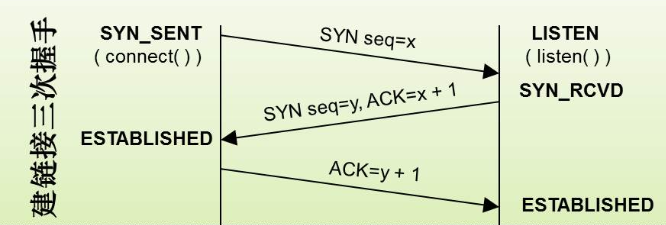
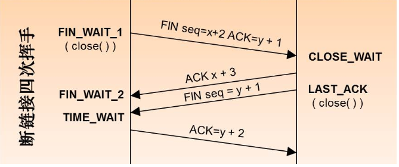

# 根据IP地址和子网掩码计算网络数和主机数

计算方法如下：

- 先全部转换为二进制；
- 网络地址：把IP地址和子网掩码的二进制按位相与，得到的就是网络地址；
- 广播地址：子网掩码中有几个零，就把IP的对应位置换为1，就是广播地址；
- 网段数：在有效子网中，有n个1，网段数是2^n；
- 在有效子网中，有n个0，主机数就是(2^n)-2；

例如：某公司有生产，销售，财务，客服四个部门，每个部门主机数不超过50台，若该公司获得一个C类地址192.168.100.1/24，该如何划分子网？

解：

​	有4个部门，划分为4个网段，即22，所以子网掩码为11111111.11111111.11111111.11000000，即255.255.255.192

​	每一段主机数(2^6)-2=62个。

##  OSI七层模型和每层的功能

OSI七层模型分为：应用层、表示层、会话层、传输层、网络层、数据链路层、物理层。

应用层：

常见应用运行的层次，提供例如http、ftp、snmp、telnet等协议；

 

表示层：

将应用处理的信息转换为适合网络传输的格式，或者将来自下层的数据转为上层数据能够处理的格式，例如进行数据的加密、打包、压缩等功能；提供例如：ssl/tls、ascii等协议；

 

会话层：

负责建立和断开数据连接以及数据的分割等数据传输相关的管理，提供rpc、adsp等协议；

 

传输层：

负责建立两点之间的数据传输，确保数据送达到目标地址，提供tcp、udp协议；

 

网络层：

负责地址管理和路由选择，提供ip、icmp协议；

 

数据链路层：

负责将0,1序列划分成数据帧并在物理层面上进行数据传输，实现设备之间的传送和识别数据帧；提供PPP、sltp等协议；

 

物理层：

将0,1序列转换为电压和脉冲管信号传输给物理介质，是整个传输过程的基础；

# 三次握手和四次分手

第一次握手：建立连接。客户端发送连接请求报文段，将SYN位置为1，Sequence Number为x；然后，客户端进入SYN_SEND状态，等待服务器的确认；

第二次握手：服务器收到客户端的SYN报文段，需要对这个SYN报文段进行确认，设置Ack Number为x+1(SeqNumber+1)；同时自己自己还要发送SYN请求信息，将SYN位置为1，SeqNumber为y；服务器端将上述所有信息放到一个报文段（即SYN+ACK报文段）中，一并发送给客户端，此时服务器进入SYN_RECV状态；

第三次握手：客户端收到服务器的SYN+ACK报文段。然后将AckNumber设置为y+1，向服务器发送ACK报文段，这个报文段发送完毕以后，客户端和服务器端都进入ESTABLISHED状态，完成TCP三次握手。

第一次分手：主机1（可以使客户端，也可以是服务器端），设置SeqNumber和AckNumber，向主机2发送一个FIN报文段；此时，主机1进入FIN_WAIT_1状态；这表示主机1没有数据要发送给主机2了；

第二次分手：主机2收到了主机1发送的FIN报文段，向主机1回一个ACK报文段，AckNumber为SeqNumber加1；主机1进入FIN_WAIT_2状态；主机2告诉主机1，我“同意”你的关闭请求；

第三次分手：主机2向主机1发送FIN报文段，请求关闭连接，同时主机2进入LAST_ACK状态；

第四次分手：主机1收到主机2发送的FIN报文段，向主机2发送ACK报文段，然后主机1进入TIME_WAIT状态；主机2收到主机1的ACK报文段以后，就关闭连接；此时主机1等待2MSL后依然没有收到回复则证明Server端已正常关闭，主机1也可以关闭连接了。